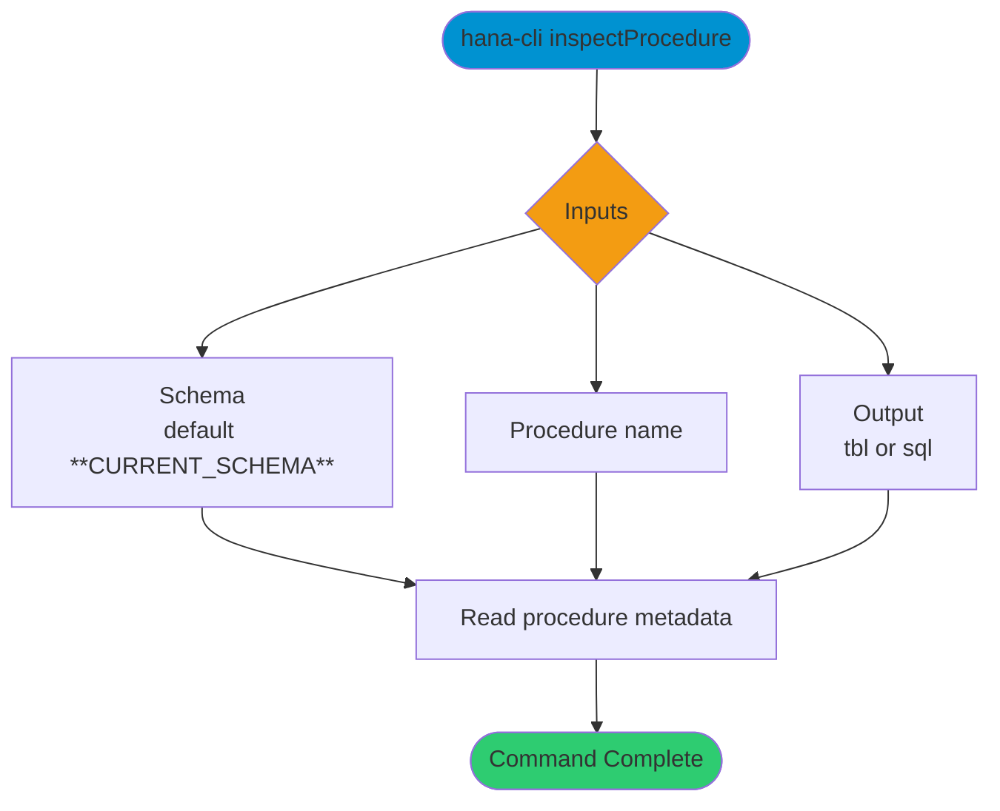

# inspectProcedure

> Command: `inspectProcedure`  
> Category: **Object Inspection**  
> Status: Production Ready

## Description

Return metadata about a Stored Procedure

## Syntax

```bash
hana-cli inspectProcedure [schema] [procedure] [options]
```

## Aliases

- `ip`
- `procedure`
- `insProc`
- `inspectprocedure`
- `inspectsp`

## Command Diagram



## Parameters

### Positional Arguments

| Parameter | Type | Description |
|---|---|---|
| `schema` | string | Target schema (optional positional input). |
| `procedure` | string | Procedure name (optional positional input). |

### Options

| Option | Alias | Type | Default | Description |
|---|---|---|---|---|
| `--procedure` | `-p`, `--sp` | string | - | Procedure name to inspect. |
| `--schema` | `-s` | string | `**CURRENT_SCHEMA**` | Schema that contains the procedure. |
| `--output` | `-o` | string | `tbl` | Output format. Choices: `tbl`, `sql`. |

## Examples

### Basic Usage

```bash
hana-cli inspectProcedure --procedure myProcedure --schema MYSCHEMA
```

Execute the command

### SQL Definition Output

```bash
hana-cli inspectProcedure --procedure myProcedure --schema MYSCHEMA --output sql
```

Display the procedure definition in SQL format.

## Related Commands

- [`procedures`](procedures.md)
- [`inspectFunction`](inspect-function.md)
- `callProcedure`

## See Also

- [Category: Object Inspection](..)
- [All Commands A-Z](../all-commands.md)
