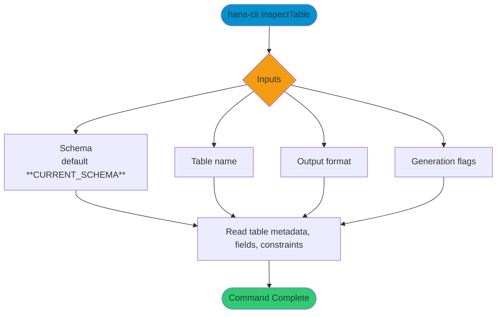

# inspectTable

> Command: `inspectTable`  
> Category: **Object Inspection**  
> Status: Production Ready

## Description

Return metadata about a DB table

## Syntax

```bash
hana-cli inspectTable [schema] [table] [options]
```

## Aliases

- `it`
- `table`
- `insTbl`
- `inspecttable`
- `inspectable`

## Command Diagram



## Parameters

### Positional Arguments

| Parameter | Type | Description |
|---|---|---|
| `schema` | string | Target schema (optional positional input). |
| `table` | string | Table name (optional positional input). |

### Options

| Option | Alias | Type | Default | Description |
|---|---|---|---|---|
| `--table` | `-t` | string | - | Table name to inspect. |
| `--schema` | `-s` | string | `**CURRENT_SCHEMA**` | Schema that contains the table. |
| `--output` | `-o` | string | `tbl` | Output format. Choices include `tbl`, `sql`, `cds`, `json`, `yaml`, `cdl`, `edm`, `edmx`, `openapi`, `graphql`, `sqlite`, `postgres`, `hdbtable`, `hdbmigrationtable`, `hdbcds`, `swgr`, `annos`, `jsdoc`. |
| `--useHanaTypes` | `--hana` | boolean | `false` | Prefer HANA-native data types in generated artifacts. |
| `--useExists` | `--exists`, `--persistence` | boolean | `true` | Include persistence annotations when generating model artifacts. |
| `--useQuoted` | `-q`, `--quoted` | boolean | `false` | Quote identifiers in generated output. |
| `--noColons` | - | boolean | `false` | Omit colons in selected generated output formats. |

## Examples

### Basic Usage

```bash
hana-cli inspectTable --table myTable --schema MYSCHEMA
```

Execute the command

### SQL Definition Output

```bash
hana-cli inspectTable --table myTable --schema MYSCHEMA --output sql
```

Display the table definition in SQL format.

---

## inspectTableUI (UI Variant)

> Command: `inspectTableUI`  
> Status: Production Ready

**Description:** Execute inspectTableUI command - UI version for inspecting table metadata

**Syntax:**

```bash
hana-cli inspectTableUI [schema] [table] [options]
```

**Aliases:**

- `itui`
- `tableUI`
- `tableui`
- `insTblUI`
- `inspecttableui`
- `inspectableui`

**Parameters:**

For a complete list of parameters and options, use:

```bash
hana-cli inspectTableUI --help
```

**Example Usage:**

```bash
hana-cli inspectTableUI
```

Execute the command

## Related Commands

- [`tables`](tables.md)
- [`inspectView`](inspect-view.md)
- `columnStats`

## See Also

- [Category: Object Inspection](..)
- [All Commands A-Z](../all-commands.md)
