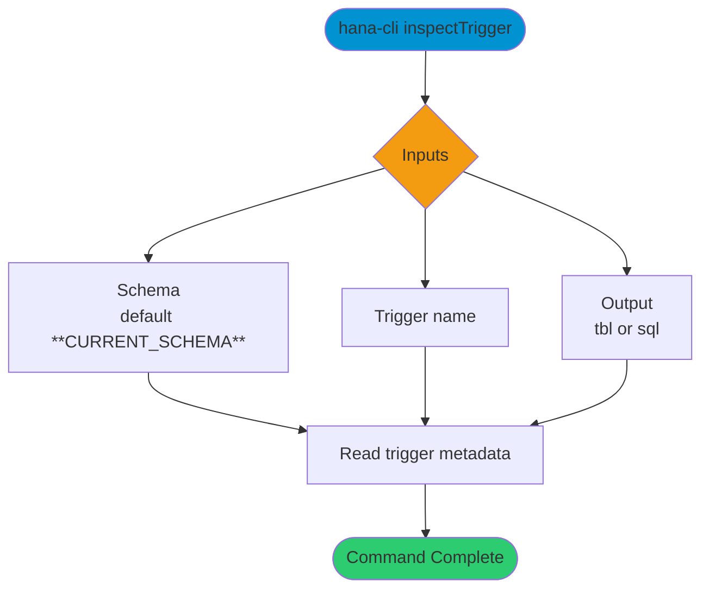

# inspectTrigger

> Command: `inspectTrigger`  
> Category: **Object Inspection**  
> Status: Production Ready

## Description

Return metadata about a Trigger

## Syntax

```bash
hana-cli inspectTrigger [schema] [trigger] [options]
```

## Aliases

- `itrig`
- `trigger`
- `insTrig`
- `inspecttrigger`
- `inspectrigger`

## Command Diagram



## Parameters

### Positional Arguments

| Parameter | Type | Description |
|---|---|---|
| `schema` | string | Target schema (optional positional input). |
| `trigger` | string | Trigger name (optional positional input). |

### Options

| Option | Alias | Type | Default | Description |
|---|---|---|---|---|
| `--trigger` | `-t` | string | `*` | Trigger name to inspect. |
| `--schema` | `-s` | string | `**CURRENT_SCHEMA**` | Schema that contains the trigger. |
| `--output` | `-o` | string | `tbl` | Output format. Choices: `tbl`, `sql`. |

## Examples

### Basic Usage

```bash
hana-cli inspectTrigger --trigger myTrigger --schema MYSCHEMA
```

Execute the command

### SQL Definition Output

```bash
hana-cli inspectTrigger --trigger myTrigger --schema MYSCHEMA --output sql
```

Display the trigger definition in SQL format.

## Related Commands

- [`triggers`](triggers.md)
- [`inspectProcedure`](inspect-procedure.md)
- [`tables`](tables.md)

## See Also

- [Category: Object Inspection](..)
- [All Commands A-Z](../all-commands.md)
