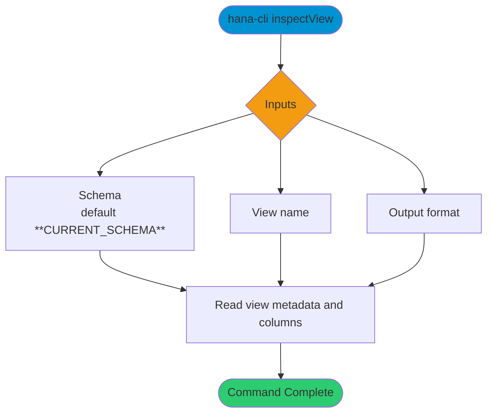

# inspectView

> Command: `inspectView`  
> Category: **Object Inspection**  
> Status: Production Ready

## Description

Return metadata about a DB view

## Syntax

```bash
hana-cli inspectView [schema] [view] [options]
```

## Aliases

- `iv`
- `view`
- `insVew`
- `inspectview`

## Command Diagram



## Parameters

### Positional Arguments

| Parameter | Type | Description |
|---|---|---|
| `schema` | string | Target schema (optional positional input). |
| `view` | string | View name (optional positional input). |

### Options

| Option | Alias | Type | Default | Description |
|---|---|---|---|---|
| `--view` | `-v` | string | - | View name to inspect. |
| `--schema` | `-s` | string | `**CURRENT_SCHEMA**` | Schema that contains the view. |
| `--output` | `-o` | string | `tbl` | Output format. Choices include `tbl`, `sql`, `cds`, `json`, `yaml`, `cdl`, `edm`, `edmx`, `openapi`, `graphql`, `sqlite`, `postgres`, `hdbview`, `hdbcds`, `swgr`, `annos`, `jsdoc`. |
| `--useHanaTypes` | `--hana` | boolean | `false` | Prefer HANA-native data types in generated artifacts. |
| `--useExists` | `--exists`, `--persistence` | boolean | `true` | Include persistence annotations when generating model artifacts. |
| `--useQuoted` | `-q`, `--quoted` | boolean | `false` | Quote identifiers in generated output. |
| `--noColons` | - | boolean | `false` | Omit colons in selected generated output formats. |

## Examples

### Basic Usage

```bash
hana-cli inspectView --view myView --schema MYSCHEMA
```

Execute the command

### SQL Definition Output

```bash
hana-cli inspectView --view myView --schema MYSCHEMA --output sql
```

Display the view definition in SQL format.

## Related Commands

- [`views`](views.md)
- [`inspectTable`](inspect-table.md)
- [`inspectProcedure`](inspect-procedure.md)

## See Also

- [Category: Object Inspection](..)
- [All Commands A-Z](../all-commands.md)
