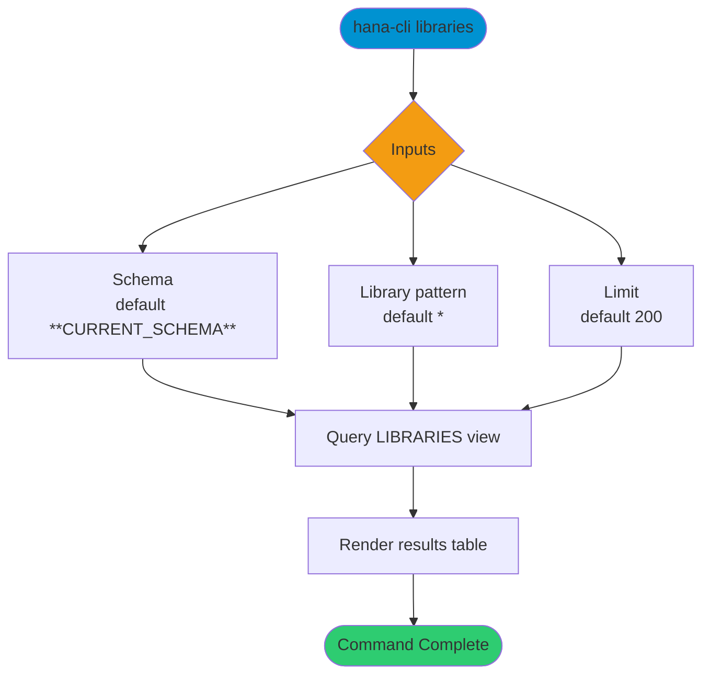

# libraries

> Command: `libraries`  
> Category: **Object Inspection**  
> Status: Production Ready

## Description

Get a list of all libraries

## Syntax

```bash
hana-cli libraries [schema] [library] [options]
```

## Aliases

- `l`
- `listLibs`
- `ListLibs`
- `listlibs`
- `ListLib`
- `listLibraries`
- `listlibraries`

## Command Diagram



## Parameters

### Positional Arguments

| Parameter | Type | Description |
|---|---|---|
| `schema` | string | Schema name filter (optional positional input). |
| `library` | string | Library name filter (optional positional input). |

### Options

| Option | Alias | Type | Default | Description |
|---|---|---|---|---|
| `--library` | `--lib` | string | `*` | Library name pattern to match. |
| `--schema` | `-s` | string | `**CURRENT_SCHEMA**` | Schema name or pattern to match. |
| `--limit` | `-l` | number | `200` | Maximum number of rows returned. |
| `--profile` | `-p` | string | - | Connection profile override. |

For additional shared options from the common command builder, use `hana-cli libraries --help`.

## Examples

### Basic Usage

```bash
hana-cli libraries --schema MYSCHEMA --library %
```

Execute the command

### Limit Results

```bash
hana-cli libraries --schema MYSCHEMA --limit 50
```

Return only the first 50 matching rows.

## Related Commands

- [`inspectLibrary`](inspect-library.md)
- [`inspectLibMember`](inspect-lib-member.md)

## See Also

- [Category: Object Inspection](..)
- [All Commands A-Z](../all-commands.md)
