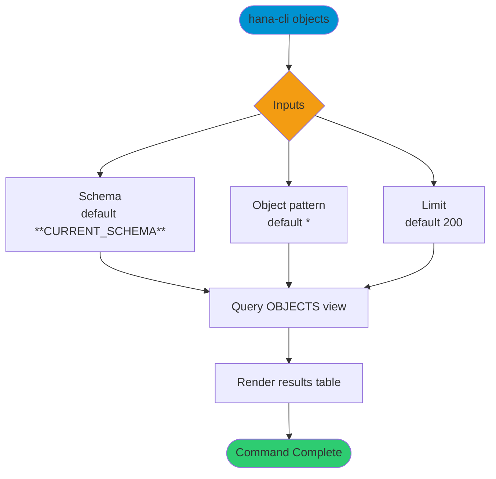

# objects

> Command: `objects`  
> Category: **Object Inspection**  
> Status: Production Ready

## Description

Search across all object types

## Syntax

```bash
hana-cli objects [schema] [object] [options]
```

## Aliases

- `o`
- `listObjects`
- `listobjects`

## Command Diagram



## Parameters

### Positional Arguments

| Parameter | Type | Description |
|---|---|---|
| `schema` | string | Schema name filter (optional positional input). |
| `object` | string | Object name filter (optional positional input). |

### Options

| Option | Alias | Type | Default | Description |
|---|---|---|---|---|
| `--object` | `-o` | string | `*` | Object name pattern to match. |
| `--schema` | `-s` | string | `**CURRENT_SCHEMA**` | Schema name or pattern to match. |
| `--limit` | `-l` | number | `200` | Maximum number of rows returned. |
| `--profile` | `-p` | string | - | Connection profile override. |

For additional shared options from the common command builder, use `hana-cli objects --help`.

## Examples

### Basic Usage

```bash
hana-cli objects --schema MYSCHEMA --object % --limit 300
```

Execute the command

### Show More Rows

```bash
hana-cli objects --schema MYSCHEMA --object % --limit 500
```

Increase result size for broader inventory views.

## Related Commands

- [`schemas`](schemas.md)
- [`tables`](tables.md)
- [`views`](views.md)

## See Also

- [Category: Object Inspection](..)
- [All Commands A-Z](../all-commands.md)
