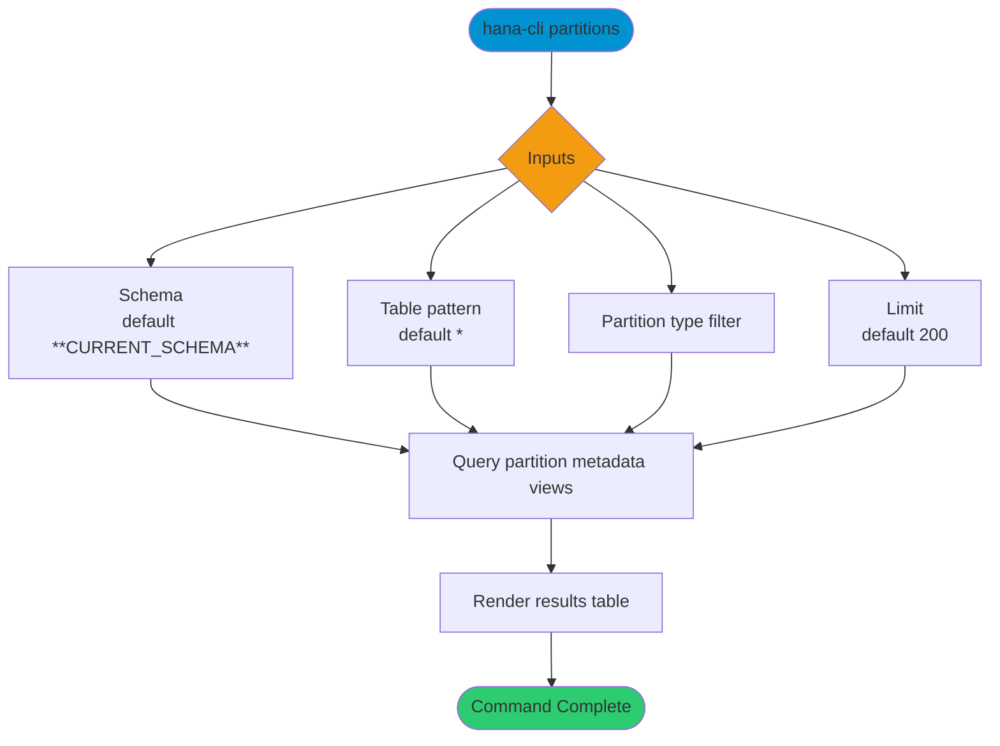

# partitions

> Command: `partitions`  
> Category: **Object Inspection**  
> Status: Production Ready

## Description

List table partitioning details

## Syntax

```bash
hana-cli partitions [schema] [table] [options]
```

## Aliases

- `parts`
- `partition`
- `partitioning`
- `tablePartitions`

## Command Diagram



## Parameters

### Positional Arguments

| Parameter | Type | Description |
|---|---|---|
| `schema` | string | Schema name filter (optional positional input). |
| `table` | string | Table name filter (optional positional input). |

### Options

| Option | Alias | Type | Default | Description |
|---|---|---|---|---|
| `--table` | `-t` | string | `*` | Table name pattern to inspect for partitioning. |
| `--schema` | `-s` | string | `**CURRENT_SCHEMA**` | Schema name or pattern to match. |
| `--type` | `--pt` | string | - | Partition type filter. |
| `--limit` | `-l` | number | `200` | Maximum number of rows returned. |
| `--profile` | `-p` | string | - | Connection profile override. |

For additional shared options from the common command builder, use `hana-cli partitions --help`.

## Examples

### Basic Usage

```bash
hana-cli partitions --table myTable --schema MYSCHEMA
```

Show partitioning details for a specific table.

## Related Commands

- [`tables`](tables.md)
- [`inspectTable`](inspect-table.md)
- `tableHotspots`

## See Also

- [Category: Object Inspection](..)
- [All Commands A-Z](../all-commands.md)
