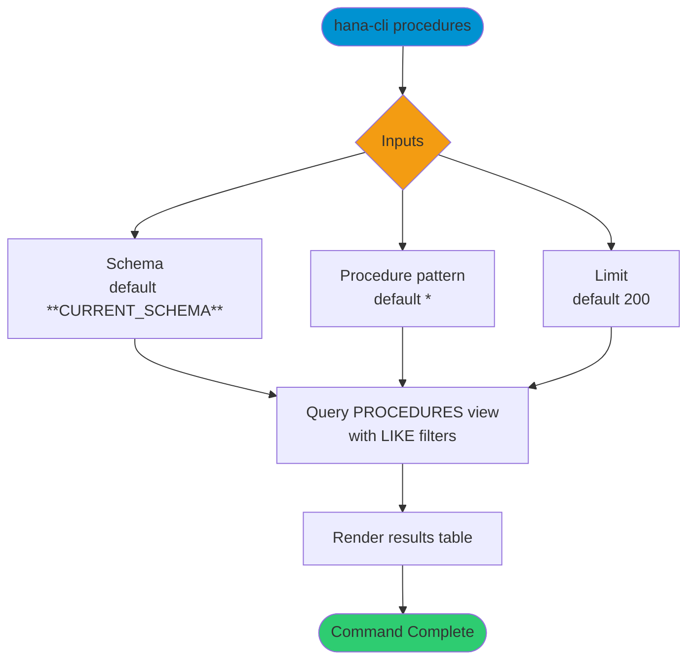

# procedures

> Command: `procedures`  
> Category: **Object Inspection**  
> Status: Production Ready

## Description

Get a list of stored procedures for a schema and procedure name pattern.

## Syntax

```bash
hana-cli procedures [schema] [procedure] [options]
```

## Aliases

- `p`
- `listProcs`
- `ListProc`
- `listprocs`
- `Listproc`
- `listProcedures`
- `listprocedures`
- `sp`

## Command Diagram



## Parameters

### Positional Arguments

| Parameter | Type | Description |
|---|---|---|
| `schema` | string | Schema name filter (optional positional input). |
| `procedure` | string | Procedure name filter (optional positional input). |

### Options

| Option | Alias | Type | Default | Description |
|---|---|---|---|---|
| `--procedure` | `-p` | string | `*` | Procedure name pattern to match. |
| `--schema` | `-s` | string | `**CURRENT_SCHEMA**` | Schema name or pattern to match. |
| `--limit` | `-l` | number | `200` | Maximum number of rows returned. |
| `--profile` | `-p` | string | - | Connection profile override. |

For additional shared options from the common command builder, use `hana-cli procedures --help`.

## Examples

### Basic Usage

```bash
hana-cli procedures --procedure myProcedure --schema MYSCHEMA
```

List procedures matching the provided schema and procedure pattern.

### Wildcard Search

```bash
hana-cli procedures --procedure "LOAD_*" --schema MYSCHEMA
```

List procedures whose names start with `LOAD_`.

### Limit Results

```bash
hana-cli procedures --schema MYSCHEMA --limit 50
```

Return only the first 50 matching rows.

## Related Commands

- [`inspectProcedure`](inspect-procedure.md)
- [`functions`](functions.md)
- [`views`](views.md)

## See Also

- [Category: Object Inspection](..)
- [All Commands A-Z](../all-commands.md)
