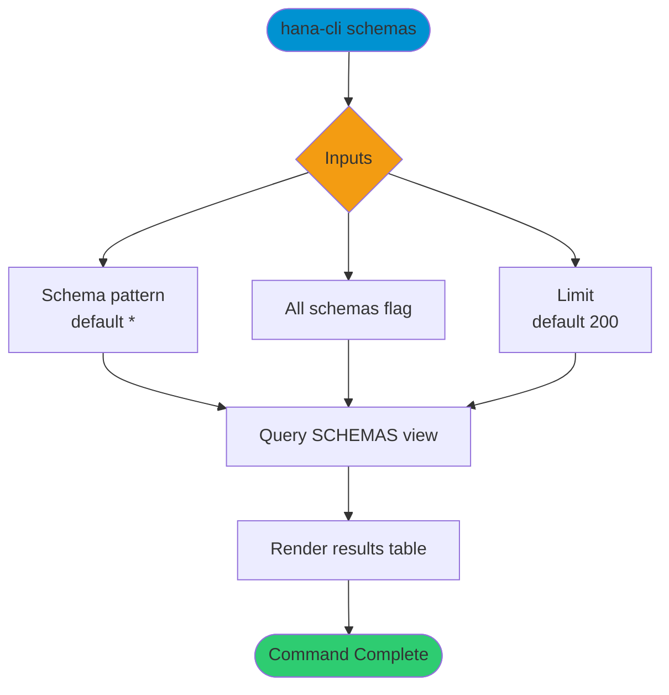

# schemas

> Command: `schemas`  
> Category: **Object Inspection**  
> Status: Production Ready

## Description

Get a list of all schemas

## Syntax

```bash
hana-cli schemas [schema] [options]
```

## Aliases

- `sch`
- `getSchemas`
- `listSchemas`
- `s`

## Command Diagram



## Parameters

### Positional Arguments

| Parameter | Type | Description |
|---|---|---|
| `schema` | string | Schema name pattern (optional positional input). |

### Options

| Option | Alias | Type | Default | Description |
|---|---|---|---|---|
| `--schema` | `-s` | string | `*` | Schema name pattern to match. |
| `--limit` | `-l` | number | `200` | Maximum number of rows returned. |
| `--all` | `--al`, `--allSchemas` | boolean | `false` | Include schemas without direct privileges. |

For additional shared options from the common command builder, use `hana-cli schemas --help`.

## Examples

### Basic Usage

```bash
hana-cli schemas --schema MYSCHEMA
```

List schemas matching the provided schema pattern.

---

## schemasUI (UI Variant)

> Command: `schemasUI`  
> Status: Production Ready

**Description:** Execute schemasUI command - UI version for listing schemas

**Syntax:**

```bash
hana-cli schemasUI [schema] [options]
```

**Aliases:**

- `schui`
- `getSchemasUI`
- `listSchemasUI`
- `schemasui`
- `getschemasui`
- `listschemasui`

**Parameters:**

For a complete list of parameters and options, use:

```bash
hana-cli schemasUI --help
```

**Example Usage:**

```bash
hana-cli schemasUI
```

Execute the command

## Related Commands

- [`objects`](objects.md)
- `schemaClone`
- [`tables`](tables.md)

## See Also

- [Category: Object Inspection](..)
- [All Commands A-Z](../all-commands.md)
