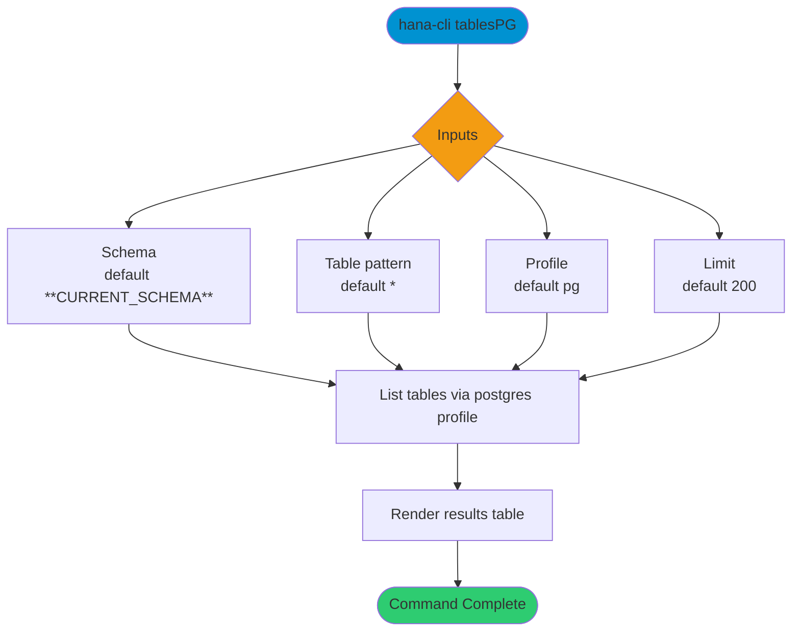

# tablesPG

> Command: `tablesPG`  
> Category: **Object Inspection**  
> Status: Production Ready

## Description

Get a list of all tables from PostgreSQL

## Syntax

```bash
hana-cli tablesPG [schema] [table] [options]
```

## Aliases

- `tablespg`
- `tablespostgres`
- `tablesPostgres`
- `tables-postgres`
- `tables-postgressql`
- `tablesPOSTGRES`

## Command Diagram



## Parameters

### Positional Arguments

| Parameter | Type | Description |
|---|---|---|
| `schema` | string | Schema name filter (optional positional input). |
| `table` | string | Table name filter (optional positional input). |

### Options

| Option | Alias | Type | Default | Description |
|---|---|---|---|---|
| `--table` | `-t` | string | `*` | PostgreSQL table name pattern to match. |
| `--schema` | `-s` | string | `**CURRENT_SCHEMA**` | Schema name or pattern to match. |
| `--profile` | `-p` | string | `pg` | Profile used to route execution to PostgreSQL mode. |
| `--limit` | `-l` | number | `200` | Maximum number of rows returned. |

For additional shared options from the common command builder, use `hana-cli tablesPG --help`.

## Examples

### Basic Usage

```bash
hana-cli tablesPG --table * --schema MYSCHEMA
```

List PostgreSQL tables matching schema and table filters.

## Related Commands

- [`tables`](tables.md)
- [`tablesSQLite`](tables-s-q-lite.md)

## See Also

- [Category: Object Inspection](..)
- [All Commands A-Z](../all-commands.md)
