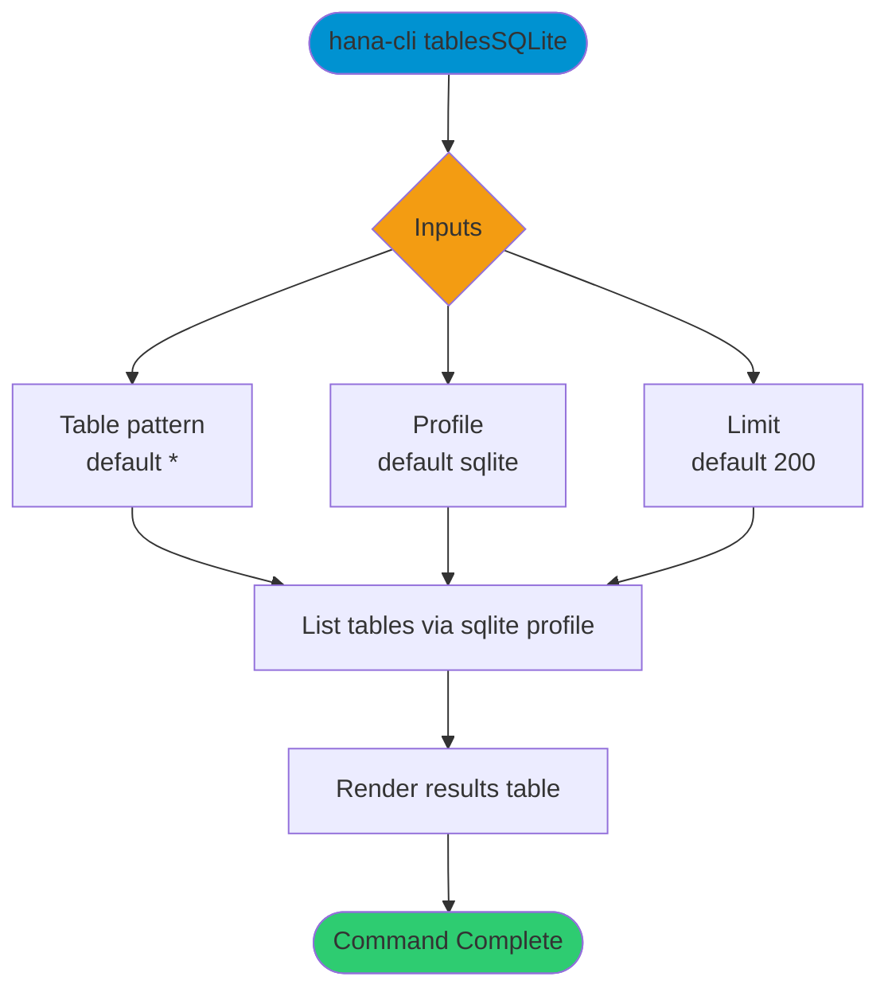

# tablesSQLite

> Command: `tablesSQLite`  
> Category: **Object Inspection**  
> Status: Production Ready

## Description

Get a list of tables from a SQLite profile

## Syntax

```bash
hana-cli tablesSQLite [table] [options]
```

## Aliases

- `tablessqlite`
- `tablesqlite`
- `tablesSqlite`
- `tables-sqlite`
- `tables-sql`
- `tablesSQL`

## Command Diagram



## Parameters

### Positional Arguments

| Parameter | Type | Description |
|---|---|---|
| `table` | string | Table name filter (optional positional input). |

### Options

| Option | Alias | Type | Default | Description |
|---|---|---|---|---|
| `--table` | `-t` | string | `*` | SQLite table name pattern to match. |
| `--profile` | `-p` | string | `sqlite` | Profile used to route execution to SQLite mode. |
| `--limit` | `-l` | number | `200` | Maximum number of rows returned. |

For additional shared options from the common command builder, use `hana-cli tablesSQLite --help`.

## Examples

### Basic Usage

```bash
hana-cli tablesSQLite --table "*" --profile sqlite
```

List SQLite tables matching the provided table pattern.

### Default Profile Behavior

```bash
hana-cli tablesSQLite --table "SALES_*"
```

Use the command's default `sqlite` profile and filter by table name pattern.

## Related Commands

- [`tables`](tables.md)
- [`tablesPG`](tables-p-g.md)

## See Also

- [Category: Object Inspection](..)
- [All Commands A-Z](../all-commands.md)
