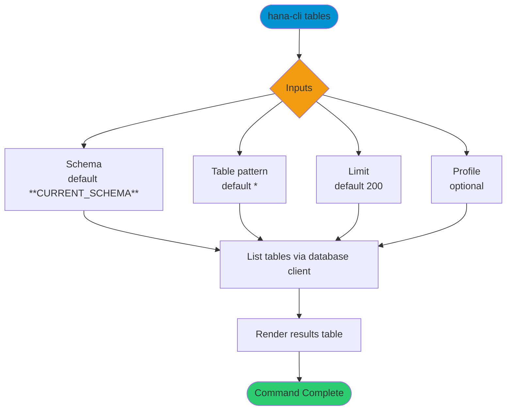

# tables

> Command: `tables`  
> Category: **Object Inspection**  
> Status: Production Ready

## Description

Get a list of tables for a schema and table name pattern.

## Syntax

```bash
hana-cli tables [schema] [table] [options]
```

## Aliases

- `t`
- `listTables`
- `listtables`

## Command Diagram



## Parameters

### Positional Arguments

| Parameter | Type | Description |
|---|---|---|
| `schema` | string | Schema name filter (optional positional input). |
| `table` | string | Table name filter (optional positional input). |

### Options

| Option | Alias | Type | Default | Description |
|---|---|---|---|---|
| `--table` | `-t` | string | `*` | Table name pattern to match. |
| `--schema` | `-s` | string | `**CURRENT_SCHEMA**` | Schema name or pattern to match. |
| `--limit` | `-l` | number | `200` | Maximum number of rows returned. |
| `--profile` | `-p` | string | - | Profile override (for example `pg` or `sqlite`). |

For additional shared options from the common command builder, use `hana-cli tables --help`.

## Examples

### Basic Usage

```bash
hana-cli tables --table myTable --schema MYSCHEMA
```

List tables matching the provided schema and table pattern.

### Wildcard Search

```bash
hana-cli tables --table "SALES_*" --schema MYSCHEMA
```

List tables whose names start with `SALES_`.

### PostgreSQL Profile

```bash
hana-cli tables --table my_table --schema public --profile pg
```

Route table listing through the PostgreSQL profile behavior.

---

## tablesUI (UI Variant)

> Command: `tablesUI`  
> Status: Production Ready

**Description:** Execute tablesUI command - UI version for listing tables

**Syntax:**

```bash
hana-cli tablesUI [schema] [table] [options]
```

**Aliases:**

- `tui`
- `listTablesUI`
- `listtablesui`
- `tablesui`

**Parameters:**

For a complete list of parameters and options, use:

```bash
hana-cli tablesUI --help
```

**Example Usage:**

```bash
hana-cli tablesUI
```

Execute the command

## Related Commands

- [`inspectTable`](inspect-table.md)
- [`tablesPG`](tables-p-g.md)
- [`schemas`](schemas.md)

## See Also

- [Category: Object Inspection](..)
- [All Commands A-Z](../all-commands.md)
