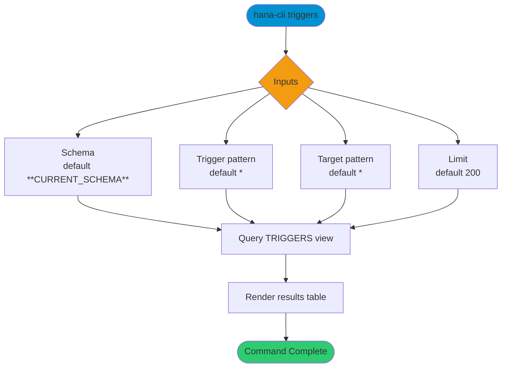

# triggers

> Command: `triggers`  
> Category: **Object Inspection**  
> Status: Production Ready

## Description

List of all triggers

## Syntax

```bash
hana-cli triggers [schema] [trigger] [target] [options]
```

## Aliases

- `trig`
- `listTriggers`
- `ListTrigs`
- `listtrigs`
- `Listtrig`
- `listrig`

## Command Diagram



## Parameters

### Positional Arguments

| Parameter | Type | Description |
|---|---|---|
| `schema` | string | Schema name filter (optional positional input). |
| `trigger` | string | Trigger name filter (optional positional input). |
| `target` | string | Target object name filter (optional positional input). |

### Options

| Option | Alias | Type | Default | Description |
|---|---|---|---|---|
| `--trigger` | `-t`, `--Trigger` | string | `*` | Trigger name pattern to match. |
| `--target` | `--to`, `--Target` | string | `*` | Subject table/target name pattern to match. |
| `--schema` | `-s` | string | `**CURRENT_SCHEMA**` | Schema name or pattern to match. |
| `--limit` | `-l` | number | `200` | Maximum number of rows returned. |
| `--profile` | `-p` | string | - | Connection profile override. |

For additional shared options from the common command builder, use `hana-cli triggers --help`.

## Examples

### Basic Usage

```bash
hana-cli triggers --schema MYSCHEMA --trigger %
```

Execute the command

### Include Target Filter

```bash
hana-cli triggers --schema MYSCHEMA --trigger % --target SALES_%
```

Filter trigger list by subject target object.

## Related Commands

- [`inspectTrigger`](inspect-trigger.md)
- [`procedures`](procedures.md)
- [`tables`](tables.md)

## See Also

- [Category: Object Inspection](..)
- [All Commands A-Z](../all-commands.md)
