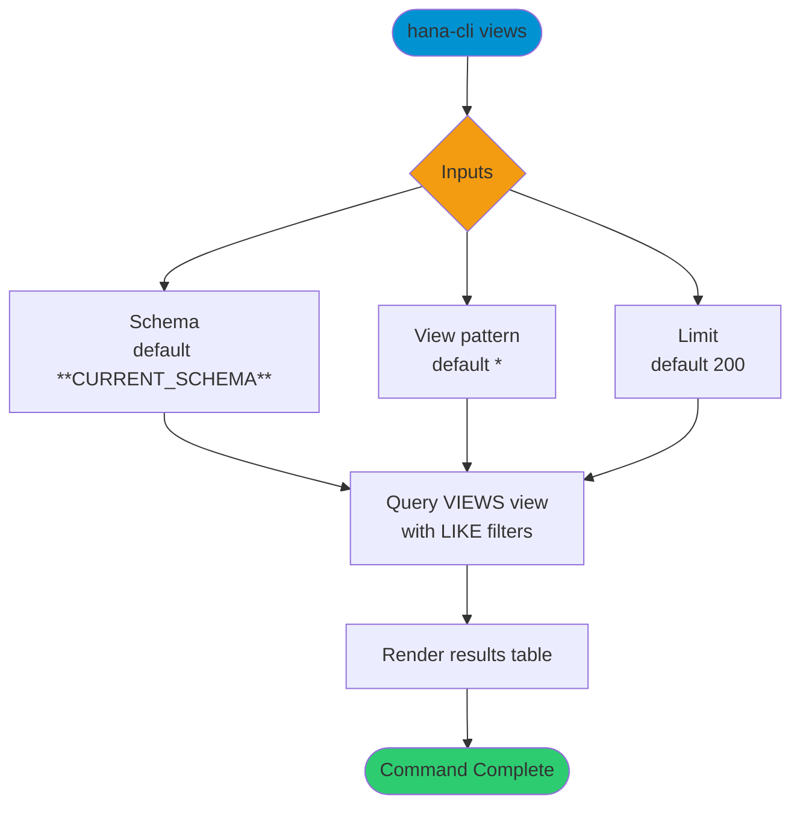

# views

> Command: `views`  
> Category: **Object Inspection**  
> Status: Production Ready

## Description

Get a list of views for a schema and view name pattern.

## Syntax

```bash
hana-cli views [schema] [view] [options]
```

## Aliases

- `v`
- `listViews`
- `listviews`

## Command Diagram



## Parameters

### Positional Arguments

| Parameter | Type | Description |
|---|---|---|
| `schema` | string | Schema name filter (optional positional input). |
| `view` | string | View name filter (optional positional input). |

### Options

| Option | Alias | Type | Default | Description |
|---|---|---|---|---|
| `--view` | `-v` | string | `*` | View name pattern to match. |
| `--schema` | `-s` | string | `**CURRENT_SCHEMA**` | Schema name or pattern to match. |
| `--limit` | `-l` | number | `200` | Maximum number of rows returned. |
| `--profile` | `-p` | string | - | Connection profile override. |

For additional shared options from the common command builder, use `hana-cli views --help`.

## Examples

### Basic Usage

```bash
hana-cli views --view myView --schema MYSCHEMA
```

List views matching the provided schema and view pattern.

### Wildcard Search

```bash
hana-cli views --view "VW_%" --schema MYSCHEMA
```

List views whose names start with `VW_`.

### Limit Results

```bash
hana-cli views --schema MYSCHEMA --limit 50
```

Return only the first 50 matching rows.

## Related Commands

- [`inspectView`](inspect-view.md)
- [`tables`](tables.md)
- [`procedures`](procedures.md)

## See Also

- [Category: Object Inspection](..)
- [All Commands A-Z](../all-commands.md)
