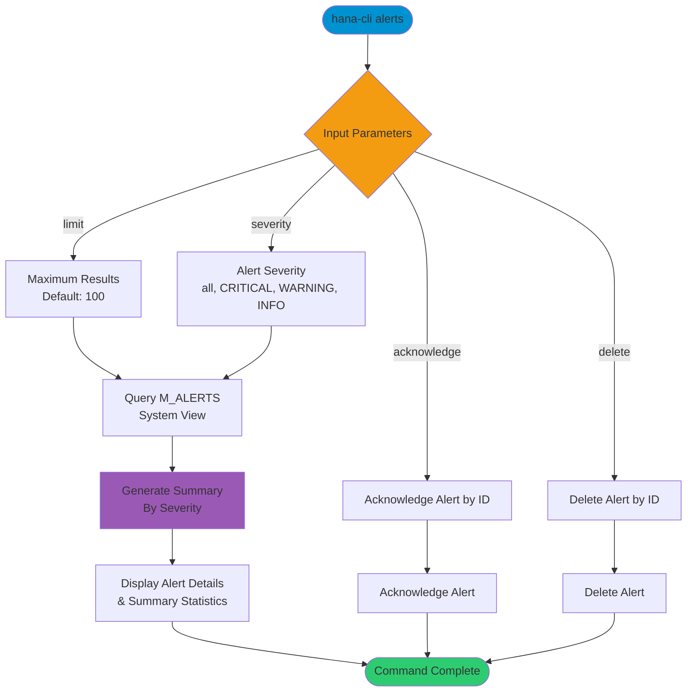

# alerts

> Command: `alerts`  
> Category: **Performance Monitoring**  
> Status: Production Ready

## Description

List and manage database alerts from the SAP HANA system. This command monitors active alerts, their severity levels, and provides capabilities to acknowledge or delete alerts by their ID.

## Syntax

```bash
hana-cli alerts [options]
```

## Aliases

- `a`
- `alert`

## Command Diagram



## Parameters

### Options

| Option          | Alias   | Type    | Default | Description                                                                 |
|-----------------|---------|---------|---------|-----------------------------------------------------------------------------|
| `--limit`       | `-l`    | number  | `100`   | Maximum number of alerts to display                                         |
| `--severity`    | `-s`    | string  | `all`   | Alert severity level. Choices: `all`, `CRITICAL`, `WARNING`, `INFO`        |
| `--acknowledge` | `--ack` | string  | -       | Acknowledge alert by ID                                                     |
| `--delete`      | `--del` | string  | -       | Delete alert by ID                                                          |

### Connection Parameters

| Option    | Alias | Type    | Default | Description                                          |
|-----------|-------|---------|---------|------------------------------------------------------|
| `--admin` | `-a`  | boolean | `false` | Connect via admin (default-env-admin.json)           |
| `--conn`  | -     | string  | -       | Connection filename to override default-env.json     |

### Troubleshooting

| Option              | Alias     | Type    | Default | Description                                                                 |
|---------------------|-----------|---------|---------|-----------------------------------------------------------------------------|
| `--disableVerbose`  | `--quiet` | boolean | `false` | Disable verbose output                                                      |
| `--debug`           | `-d`      | boolean | `false` | Debug hana-cli itself by adding output of intermediate details             |

## Examples

### Filter Critical Alerts

```bash
hana-cli alerts --severity CRITICAL
```

List only critical alerts from the system.

### List All Alerts with Custom Limit

```bash
hana-cli alerts --severity all --limit 50
```

Display up to 50 alerts of all severity levels.

### Acknowledge an Alert

```bash
hana-cli alerts --acknowledge 12345
```

Acknowledge a specific alert by its ID.

### Delete an Alert

```bash
hana-cli alerts --delete 12345
```

Delete a specific alert by its ID.

## Related Commands

See the [Commands Reference](../all-commands.md) for other commands in this category.

## See Also

- [Category: Performance Monitoring](..)
- [All Commands A-Z](../all-commands.md)
