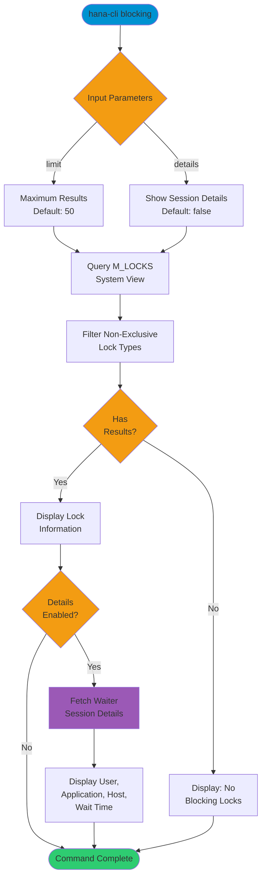

# blocking

> Command: `blocking`  
> Category: **Performance Monitoring**  
> Status: Production Ready

## Description

Show blocking sessions and lock chains in the SAP HANA database. This command helps identify which sessions are holding locks and which sessions are waiting for those locks, including detailed information about lock duration, type, and affected database objects.

## Syntax

```bash
hana-cli blocking [options]
```

## Aliases

- `b`
- `locks`

## Command Diagram



## Parameters

### Options

| Option      | Alias | Type    | Default | Description                                                      |
|-------------|-------|---------|---------|------------------------------------------------------------------|
| `--limit`   | `-l`  | number  | `50`    | Maximum number of blocking locks to display                      |
| `--details` | `-d`  | boolean | `false` | Show detailed information about waiter sessions                  |

### Connection Parameters

| Option    | Alias | Type    | Default | Description                                          |
|-----------|-------|---------|---------|------------------------------------------------------|
| `--admin` | `-a`  | boolean | `false` | Connect via admin (default-env-admin.json)           |
| `--conn`  | -     | string  | -       | Connection filename to override default-env.json     |

### Troubleshooting

| Option              | Alias     | Type    | Default | Description                                                                 |
|---------------------|-----------|---------|---------|-----------------------------------------------------------------------------|
| `--disableVerbose`  | `--quiet` | boolean | `false` | Disable verbose output                                                      |
| `--debug`           | `-d`      | boolean | `false` | Debug hana-cli itself by adding output of intermediate details             |

## Examples

### Basic Usage

```bash
hana-cli blocking
```

Display blocking sessions and lock chains with default settings.

### Show Detailed Information

```bash
hana-cli blocking --limit 50 --details
```

Display blocking locks with detailed information about waiter sessions including user, application, and wait time.

### Limit Results

```bash
hana-cli blocking --limit 25
```

Display only the top 25 blocking locks.

## Related Commands

See the [Commands Reference](../all-commands.md) for other commands in this category.

## See Also

- [Category: Performance Monitoring](..)
- [All Commands A-Z](../all-commands.md)
