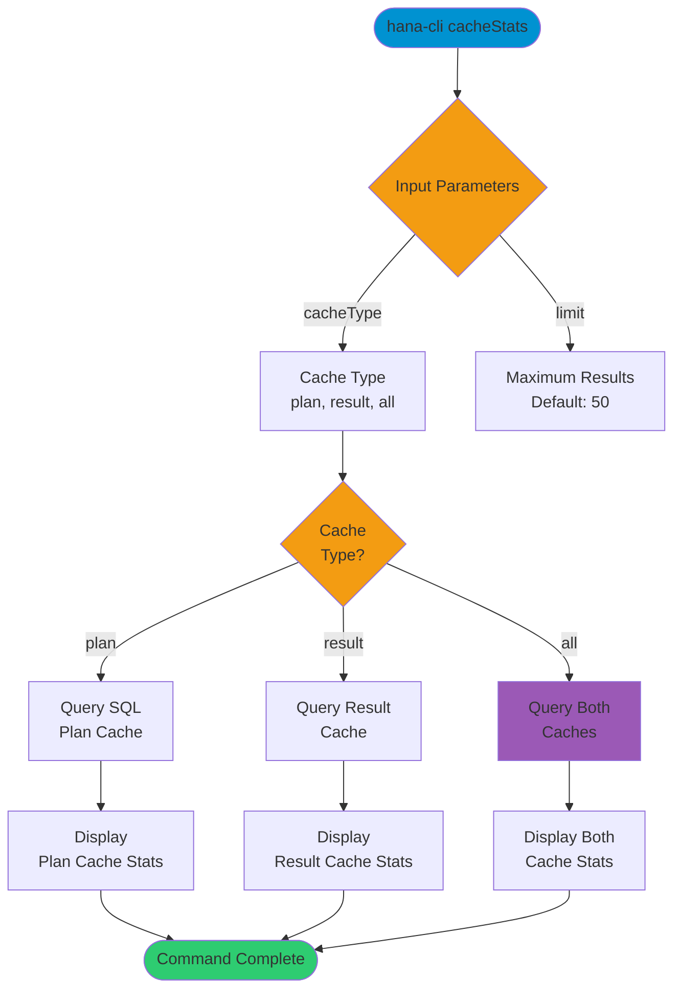

# cacheStats

> Command: `cacheStats`  
> Category: **Performance Monitoring**  
> Status: Production Ready

## Description

View SQL plan cache and result cache statistics from the SAP HANA database. This command provides insights into the performance and efficiency of SQL statement caching mechanisms.

## Syntax

```bash
hana-cli cacheStats [options]
```

## Aliases

This command has no aliases.

## Command Diagram



## Parameters

### Options

| Option        | Alias | Type   | Default | Description                                                  |
|---------------|-------|--------|---------|--------------------------------------------------------------|
| `--cacheType` | `-t`  | string | `all`   | Type of cache to query. Choices: `plan`, `result`, `all`   |
| `--limit`     | `-l`  | number | `50`    | Maximum number of cache entries to display                   |

### Connection Parameters

| Option    | Alias | Type    | Default | Description                                          |
|-----------|-------|---------|---------|------------------------------------------------------|
| `--admin` | `-a`  | boolean | `false` | Connect via admin (default-env-admin.json)           |
| `--conn`  | -     | string  | -       | Connection filename to override default-env.json     |

### Troubleshooting

| Option              | Alias     | Type    | Default | Description                                                                 |
|---------------------|-----------|---------|---------|-----------------------------------------------------------------------------|
| `--disableVerbose`  | `--quiet` | boolean | `false` | Disable verbose output                                                      |
| `--debug`           | `-d`      | boolean | `false` | Debug hana-cli itself by adding output of intermediate details             |

## Examples

### View All Cache Statistics

```bash
hana-cli cacheStats --cacheType all
```

View both SQL plan cache and result cache statistics.

### View Plan Cache Only

```bash
hana-cli cacheStats --cacheType plan --limit 100
```

View only the SQL plan cache with up to 100 entries.

### View Result Cache Only

```bash
hana-cli cacheStats --cacheType result
```

View only the result cache statistics.

## Related Commands

See the [Commands Reference](../all-commands.md) for other commands in this category.

## See Also

- [Category: Performance Monitoring](..)
- [All Commands A-Z](../all-commands.md)
