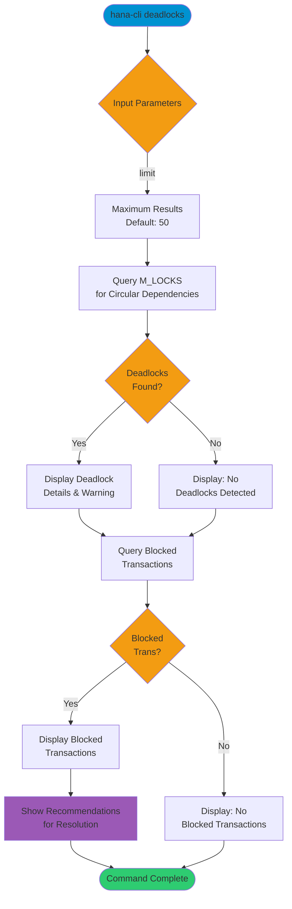

# deadlocks

> Command: `deadlocks`  
> Category: **Performance Monitoring**  
> Status: Production Ready

## Description

Analyze and detect deadlock situations in the SAP HANA database. This command identifies circular lock dependencies (deadlocks) and blocked transactions, providing recommendations for resolution.

## Syntax

```bash
hana-cli deadlocks [options]
```

## Aliases

- `deadlock`
- `dl`

## Command Diagram



## Parameters

### Options

| Option    | Alias | Type   | Default | Description                                         |
|-----------|-------|--------|---------|-----------------------------------------------------|
| `--limit` | `-l`  | number | `50`    | Maximum number of blocked transactions to display   |

### Connection Parameters

| Option    | Alias | Type    | Default | Description                                          |
|-----------|-------|---------|---------|------------------------------------------------------|
| `--admin` | `-a`  | boolean | `false` | Connect via admin (default-env-admin.json)           |
| `--conn`  | -     | string  | -       | Connection filename to override default-env.json     |

### Troubleshooting

| Option              | Alias     | Type    | Default | Description                                                                 |
|---------------------|-----------|---------|---------|-----------------------------------------------------------------------------|
| `--disableVerbose`  | `--quiet` | boolean | `false` | Disable verbose output                                                      |
| `--debug`           | `-d`      | boolean | `false` | Debug hana-cli itself by adding output of intermediate details             |

## Examples

### Analyze Deadlocks

```bash
hana-cli deadlocks --limit 50
```

Analyze the database for deadlocks and blocked transactions with a limit of 50 results.

### Quick Deadlock Check

```bash
hana-cli deadlocks
```

Perform a quick deadlock analysis with default settings.

### Detailed Deadlock Analysis

```bash
hana-cli deadlocks --limit 100
```

Perform a comprehensive deadlock analysis with up to 100 blocked transactions displayed.

## Related Commands

See the [Commands Reference](../all-commands.md) for other commands in this category.

## See Also

- [Category: Performance Monitoring](..)
- [All Commands A-Z](../all-commands.md)
