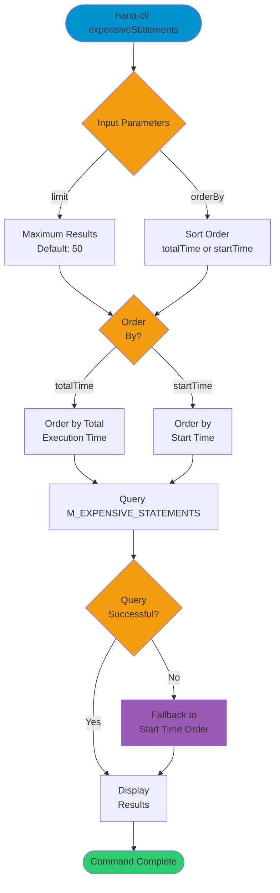

# expensiveStatements

> Command: `expensiveStatements`  
> Category: **Performance Monitoring**  
> Status: Production Ready

## Description

View top resource-consuming SQL statements from the SAP HANA database. This command retrieves expensive statements from the M_EXPENSIVE_STATEMENTS monitoring view and allows sorting by different criteria.

## Syntax

```bash
hana-cli expensiveStatements [options]
```

## Aliases

This command has no aliases.

## Command Diagram



## Parameters

### Options

| Option      | Alias | Type   | Default      | Description                                                              |
|-------------|-------|--------|--------------|--------------------------------------------------------------------------|
| `--limit`   | `-l`  | number | `50`         | Maximum number of expensive statements to display                        |
| `--orderBy` | `-o`  | string | `totalTime`  | Sort order. Choices: `totalTime`, `startTime`                           |

### Connection Parameters

| Option    | Alias | Type    | Default | Description                                          |
|-----------|-------|---------|---------|------------------------------------------------------|
| `--admin` | `-a`  | boolean | `false` | Connect via admin (default-env-admin.json)           |
| `--conn`  | -     | string  | -       | Connection filename to override default-env.json     |

### Troubleshooting

| Option              | Alias     | Type    | Default | Description                                                                 |
|---------------------|-----------|---------|---------|-----------------------------------------------------------------------------|
| `--disableVerbose`  | `--quiet` | boolean | `false` | Disable verbose output                                                      |
| `--debug`           | `-d`      | boolean | `false` | Debug hana-cli itself by adding output of intermediate details             |

## Examples

### View Most Expensive Statements by Total Time

```bash
hana-cli expensiveStatements --limit 50 --orderBy totalTime
```

Display the top 50 most expensive statements ordered by total execution time.

### View Recent Expensive Statements

```bash
hana-cli expensiveStatements --orderBy startTime --limit 25
```

Display the 25 most recent expensive statements ordered by start time.

### Quick Check of Top Expensive Statements

```bash
hana-cli expensiveStatements
```

Display expensive statements with default settings (top 50, ordered by total time).

## Related Commands

See the [Commands Reference](../all-commands.md) for other commands in this category.

## See Also

- [Category: Performance Monitoring](..)
- [All Commands A-Z](../all-commands.md)
