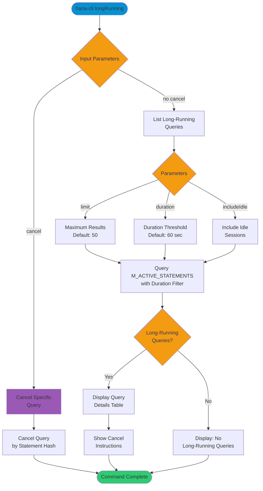

# longRunning

> Command: `longRunning`  
> Category: **Performance Monitoring**  
> Status: Production Ready

## Description

List long-running queries with ability to cancel them. This command monitors active statements that exceed a specified duration threshold and provides detailed information about their resource consumption, with an option to cancel specific queries by statement hash.

## Syntax

```bash
hana-cli longRunning [options]
```

## Aliases

- `lr`
- `longrunning`

## Command Diagram



## Parameters

### Options

| Option          | Alias | Type    | Default | Description                                                      |
|-----------------|-------|---------|---------|------------------------------------------------------------------|
| `--limit`       | `-l`  | number  | `50`    | Maximum number of long-running queries to display                |
| `--duration`    | `-d`  | number  | `60`    | Minimum query duration in seconds to include in results          |
| `--includeIdle` | `-i`  | boolean | `false` | Include idle sessions in the results                             |
| `--cancel`      | `-c`  | string  | -       | Statement hash of the query to cancel                            |

### Connection Parameters

| Option    | Alias | Type    | Default | Description                                          |
|-----------|-------|---------|---------|------------------------------------------------------|
| `--admin` | `-a`  | boolean | `false` | Connect via admin (default-env-admin.json)           |
| `--conn`  | -     | string  | -       | Connection filename to override default-env.json     |

### Troubleshooting

| Option              | Alias     | Type    | Default | Description                                                                 |
|---------------------|-----------|---------|---------|-----------------------------------------------------------------------------|
| `--disableVerbose`  | `--quiet` | boolean | `false` | Disable verbose output                                                      |
| `--debug`           | `-d`      | boolean | `false` | Debug hana-cli itself by adding output of intermediate details             |

## Examples

### List Long-Running Queries

```bash
hana-cli longRunning --limit 50 --duration 60
```

Display up to 50 queries that have been running for more than 60 seconds.

### Include Idle Sessions

```bash
hana-cli longRunning --duration 120 --includeIdle
```

List queries running longer than 2 minutes, including idle sessions.

### Cancel a Specific Query

```bash
hana-cli longRunning --cancel ABC123DEF456
```

Cancel a specific query using its statement hash.

### Quick Check with Default Settings

```bash
hana-cli longRunning
```

List queries running longer than 60 seconds with default limit of 50.

## Related Commands

See the [Commands Reference](../all-commands.md) for other commands in this category.

## See Also

- [Category: Performance Monitoring](..)
- [All Commands A-Z](../all-commands.md)
