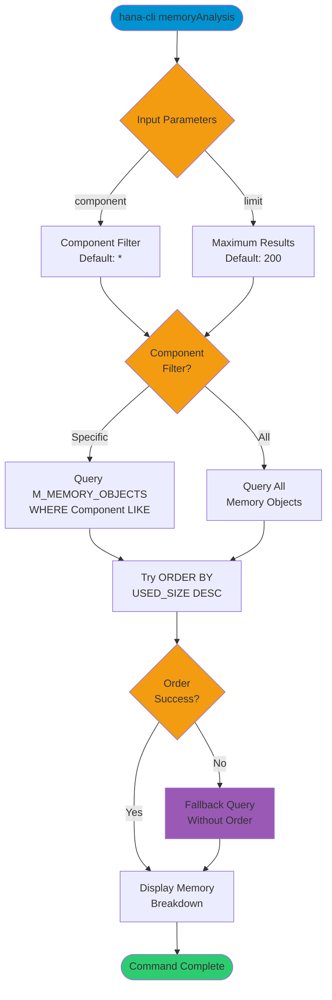

# memoryAnalysis

> Command: `memoryAnalysis`  
> Category: **Performance Monitoring**  
> Status: Production Ready

## Description

Memory consumption breakdown by component in the SAP HANA database. This command provides detailed insights into memory usage across different database components, helping identify memory-intensive areas.

## Syntax

```bash
hana-cli memoryAnalysis [options]
```

## Aliases

This command has no aliases.

## Command Diagram



## Parameters

### Options

| Option        | Alias | Type   | Default | Description                                                      |
|---------------|-------|--------|---------|------------------------------------------------------------------|
| `--component` | `-c`  | string | `*`     | Component name pattern to filter memory objects (supports wildcards) |
| `--limit`     | `-l`  | number | `200`   | Maximum number of memory objects to display                      |

### Connection Parameters

| Option    | Alias | Type    | Default | Description                                          |
|-----------|-------|---------|---------|------------------------------------------------------|
| `--admin` | `-a`  | boolean | `false` | Connect via admin (default-env-admin.json)           |
| `--conn`  | -     | string  | -       | Connection filename to override default-env.json     |

### Troubleshooting

| Option              | Alias     | Type    | Default | Description                                                                 |
|---------------------|-----------|---------|---------|-----------------------------------------------------------------------------|
| `--disableVerbose`  | `--quiet` | boolean | `false` | Disable verbose output                                                      |
| `--debug`           | `-d`      | boolean | `false` | Debug hana-cli itself by adding output of intermediate details             |

## Examples

### Analyze Indexserver Memory

```bash
hana-cli memoryAnalysis --component indexserver --limit 200
```

Show memory consumption breakdown for the indexserver component with up to 200 entries.

### Analyze All Components

```bash
hana-cli memoryAnalysis --component * --limit 500
```

Display memory consumption for all components with up to 500 entries.

### Quick Memory Overview

```bash
hana-cli memoryAnalysis
```

Show overall memory consumption with default settings (all components, 200 entries).

## Related Commands

See the [Commands Reference](../all-commands.md) for other commands in this category.

## See Also

- [Category: Performance Monitoring](..)
- [All Commands A-Z](../all-commands.md)
