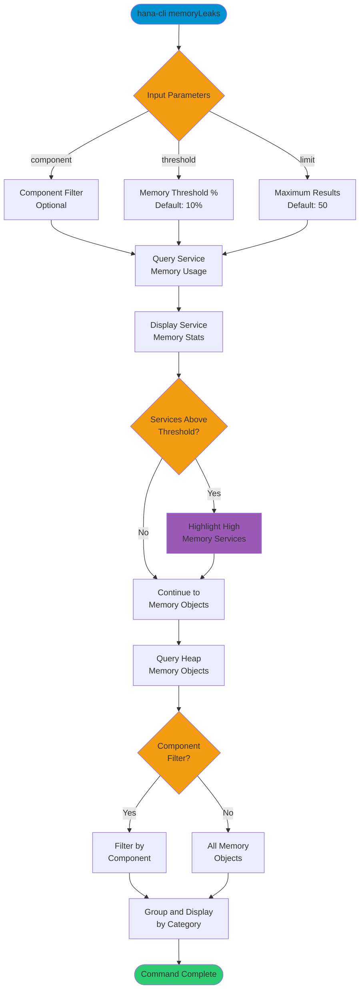

# memoryLeaks

> Command: `memoryLeaks`  
> Category: **Performance Monitoring**  
> Status: Production Ready

## Description

Detect potential memory leaks in the SAP HANA database. This command analyzes service memory usage and heap memory objects to identify services exceeding memory thresholds and potential leak indicators.

## Syntax

```bash
hana-cli memoryLeaks [options]
```

## Aliases

- `memleak`
- `ml`

## Command Diagram



## Parameters

### Options

| Option        | Alias | Type   | Default | Description                                                          |
|---------------|-------|--------|---------|----------------------------------------------------------------------|
| `--component` | `-c`  | string | -       | Component name to filter memory objects (optional)                   |
| `--threshold` | `-t`  | number | `10`    | Memory usage threshold percentage to flag services                   |
| `--limit`     | `-l`  | number | `50`    | Maximum number of memory objects to display                          |

### Connection Parameters

| Option    | Alias | Type    | Default | Description                                          |
|-----------|-------|---------|---------|------------------------------------------------------|
| `--admin` | `-a`  | boolean | `false` | Connect via admin (default-env-admin.json)           |
| `--conn`  | -     | string  | -       | Connection filename to override default-env.json     |

### Troubleshooting

| Option              | Alias     | Type    | Default | Description                                                                 |
|---------------------|-----------|---------|---------|-----------------------------------------------------------------------------|
| `--disableVerbose`  | `--quiet` | boolean | `false` | Disable verbose output                                                      |
| `--debug`           | `-d`      | boolean | `false` | Debug hana-cli itself by adding output of intermediate details             |

## Examples

### Detect Memory Leaks with High Threshold

```bash
hana-cli memoryLeaks --threshold 25 --limit 100
```

Detect services using more than 25% of their allocated heap memory, showing up to 100 memory objects.

### Analyze Specific Component

```bash
hana-cli memoryLeaks --component indexserver --threshold 15
```

Analyze memory usage specifically for the indexserver component with a 15% threshold.

### Quick Memory Leak Check

```bash
hana-cli memoryLeaks
```

Perform a memory leak check with default settings (10% threshold, 50 objects).

## Related Commands

See the [Commands Reference](../all-commands.md) for other commands in this category.

## See Also

- [Category: Performance Monitoring](..)
- [All Commands A-Z](../all-commands.md)
