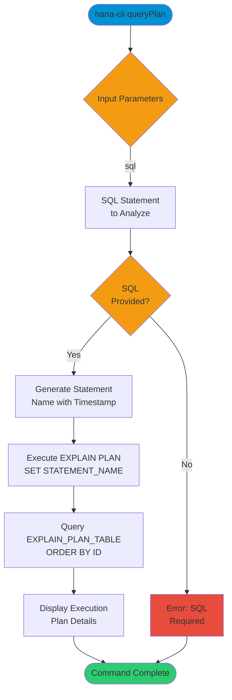

# queryPlan

> Command: `queryPlan`  
> Category: **Performance Monitoring**  
> Status: Production Ready

## Description

Visualize query execution plan for a SQL statement. This command uses the EXPLAIN PLAN functionality of SAP HANA to show how the database will execute a given SQL query, helping identify performance bottlenecks.

## Syntax

```bash
hana-cli queryPlan [options]
```

## Aliases

This command has no aliases.

## Command Diagram



## Parameters

### Options

| Option  | Alias       | Type   | Default | Description                                 |
|---------|-------------|--------|---------|---------------------------------------------|
| `--sql` | `-q`, `--sql` | string | -       | SQL query to analyze (required)             |

### Connection Parameters

| Option    | Alias | Type    | Default | Description                                          |
|-----------|-------|---------|---------|------------------------------------------------------|
| `--admin` | `-a`  | boolean | `false` | Connect via admin (default-env-admin.json)           |
| `--conn`  | -     | string  | -       | Connection filename to override default-env.json     |

### Troubleshooting

| Option              | Alias     | Type    | Default | Description                                                                 |
|---------------------|-----------|---------|---------|-----------------------------------------------------------------------------|
| `--disableVerbose`  | `--quiet` | boolean | `false` | Disable verbose output                                                      |
| `--debug`           | `-d`      | boolean | `false` | Debug hana-cli itself by adding output of intermediate details             |

## Examples

### Analyze Simple SELECT Query

```bash
hana-cli queryPlan --sql "SELECT * FROM CUSTOMERS"
```

Generate and display the execution plan for a simple SELECT query.

### Analyze Complex Query with Joins

```bash
hana-cli queryPlan --sql "SELECT c.NAME, o.ORDER_ID FROM CUSTOMERS c JOIN ORDERS o ON c.ID = o.CUSTOMER_ID WHERE c.REGION = 'US'"
```

Analyze the execution plan for a query with joins and filters.

### Analyze Aggregation Query

```bash
hana-cli queryPlan --sql "SELECT REGION, COUNT(*) FROM CUSTOMERS GROUP BY REGION"
```

View the execution plan for an aggregation query.

## Related Commands

See the [Commands Reference](../all-commands.md) for other commands in this category.

## See Also

- [Category: Performance Monitoring](..)
- [All Commands A-Z](../all-commands.md)
