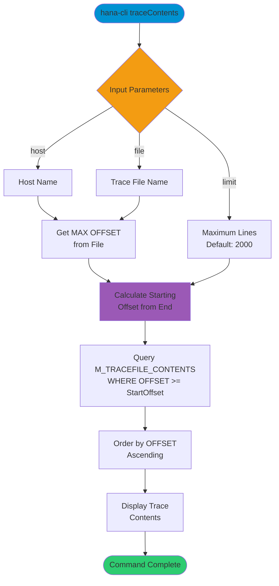

# traceContents

> Command: `traceContents`  
> Category: **Performance Monitoring**  
> Status: Production Ready

## Description

Contents of a selected trace file - Reading from the end of the file backwards. This command retrieves the most recent entries from a SAP HANA trace file by reading from the end of the file, useful for troubleshooting recent issues.

## Syntax

```bash
hana-cli traceContents [host] [file] [options]
```

## Aliases

- `tc`
- `traceContent`
- `tracecontent`

## Command Diagram



## Parameters

### Positional Arguments

| Parameter | Type   | Description                          |
|-----------|--------|--------------------------------------|
| `host`    | string | Host name where the trace file is located |
| `file`    | string | Trace file name to retrieve contents from |

### Options

| Option    | Alias             | Type   | Default | Description                                    |
|-----------|-------------------|--------|---------|------------------------------------------------|
| `--host`  | `--ho`, `--Host`  | string | -       | Host name (can also be positional)             |
| `--file`  | `-f`, `--File`    | string | -       | Trace file name (can also be positional)       |
| `--limit` | `-l`              | number | `2000`  | Maximum number of lines to read from the file  |

### Connection Parameters

| Option    | Alias | Type    | Default | Description                                          |
|-----------|-------|---------|---------|------------------------------------------------------|
| `--admin` | `-a`  | boolean | `false` | Connect via admin (default-env-admin.json)           |
| `--conn`  | -     | string  | -       | Connection filename to override default-env.json     |

### Troubleshooting

| Option              | Alias     | Type    | Default | Description                                                                 |
|---------------------|-----------|---------|---------|-----------------------------------------------------------------------------|
| `--disableVerbose`  | `--quiet` | boolean | `false` | Disable verbose output                                                      |
| `--debug`           | `-d`      | boolean | `false` | Debug hana-cli itself by adding output of intermediate details             |

## Examples

### Read Trace File with Custom Limit

```bash
hana-cli traceContents --host myhost --file tracefile --limit 1000
```

Retrieve the last 1000 lines from a trace file on the specified host.

### Read Trace File with Positional Arguments

```bash
hana-cli traceContents myhost indexserver_alert_12345.trc
```

Retrieve trace contents using positional arguments for host and file.

### Read with Default Limit

```bash
hana-cli traceContents --host hanaserver --file indexserver.trc
```

Read trace file with default limit of 2000 lines.

## Related Commands

See the [Commands Reference](../all-commands.md) for other commands in this category.

## See Also

- [Category: Performance Monitoring](..)
- [All Commands A-Z](../all-commands.md)
