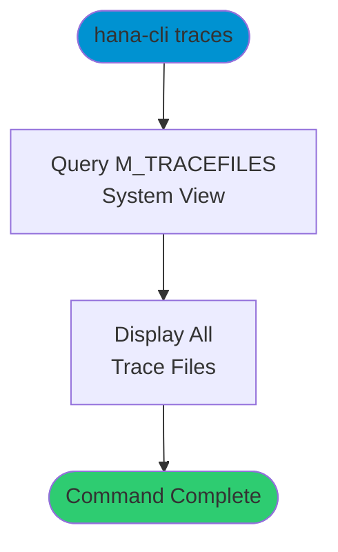

# traces

> Command: `traces`  
> Category: **Performance Monitoring**  
> Status: Production Ready

## Description

List all trace files available in the SAP HANA database. This command provides an overview of all trace files, their locations, and properties, which is useful for troubleshooting and performance analysis.

## Syntax

```bash
hana-cli traces [options]
```

## Aliases

- `tf`
- `Traces`

## Command Diagram



## Parameters

### Connection Parameters

| Option    | Alias | Type    | Default | Description                                          |
|-----------|-------|---------|---------|------------------------------------------------------|
| `--admin` | `-a`  | boolean | `false` | Connect via admin (default-env-admin.json)           |
| `--conn`  | -     | string  | -       | Connection filename to override default-env.json     |

### Troubleshooting

| Option              | Alias     | Type    | Default | Description                                                                 |
|---------------------|-----------|---------|---------|-----------------------------------------------------------------------------|
| `--disableVerbose`  | `--quiet` | boolean | `false` | Disable verbose output                                                      |
| `--debug`           | `-d`      | boolean | `false` | Debug hana-cli itself by adding output of intermediate details             |

## Examples

### List All Trace Files

```bash
hana-cli traces
```

Display a list of all trace files available in the database.

### List Traces Using Alias

```bash
hana-cli tf
```

Quickly list all trace files using the short alias.

## Related Commands

See the [Commands Reference](../all-commands.md) for other commands in this category.

## See Also

- [Category: Performance Monitoring](..)
- [All Commands A-Z](../all-commands.md)
