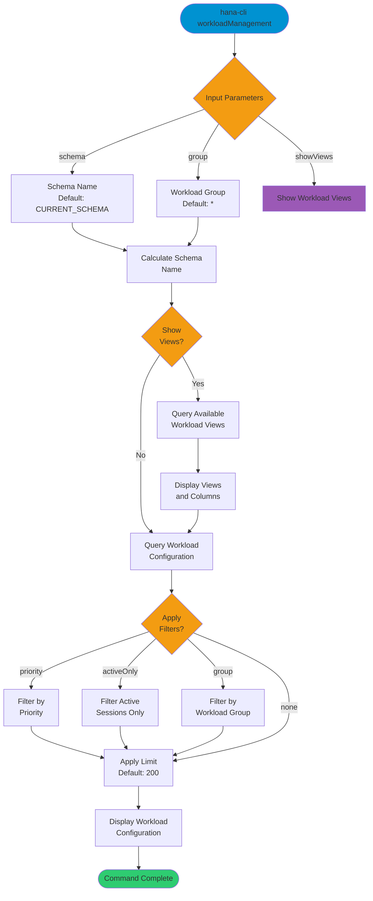

# workloadManagement

> Command: `workloadManagement`  
> Category: **Performance Monitoring**  
> Status: Production Ready

## Description

Configure and view workload classes and mappings in the SAP HANA database. This command helps manage workload management configuration, including priority settings, active sessions, and available workload views.

## Syntax

```bash
hana-cli workloadManagement [schema] [group] [options]
```

## Aliases

- `wlm`
- `workloads`
- `workloadClass`
- `workloadmgmt`

## Command Diagram



## Parameters

### Positional Arguments

| Parameter | Type   | Description                                    |
|-----------|--------|------------------------------------------------|
| `schema`  | string | Schema name (default: current schema)          |
| `group`   | string | Workload group name pattern (default: `*`)     |

### Options

| Option        | Alias           | Type    | Default               | Description                                                  |
|---------------|-----------------|---------|------------------------|--------------------------------------------------------------|
| `--group`     | `-g`            | string  | `*`                   | Workload group name pattern                                  |
| `--workload`  | `-w`            | string  | -                     | Workload class name                                          |
| `--schema`    | `-s`            | string  | `**CURRENT_SCHEMA**`  | Schema name                                                  |
| `--priority`  | `-p`            | string  | -                     | Workload priority filter                                     |
| `--activeOnly`| `-a`            | boolean | `false`               | Show only workload groups with active sessions               |
| `--showViews` | `--sv`, `--views`| boolean | `false`               | Include available workload views and their columns           |
| `--limit`     | `-l`            | number  | `200`                 | Maximum number of results to display                         |

### Connection Parameters

| Option    | Alias | Type    | Default | Description                                          |
|-----------|-------|---------|---------|------------------------------------------------------|
| `--admin` | `-a`  | boolean | `false` | Connect via admin (default-env-admin.json)           |
| `--conn`  | -     | string  | -       | Connection filename to override default-env.json     |

### Troubleshooting

| Option              | Alias     | Type    | Default | Description                                                                 |
|---------------------|-----------|---------|---------|-----------------------------------------------------------------------------|
| `--disableVerbose`  | `--quiet` | boolean | `false` | Disable verbose output                                                      |
| `--debug`           | `-d`      | boolean | `false` | Debug hana-cli itself by adding output of intermediate details             |

## Examples

### Show Available Workload Views

```bash
hana-cli workloadManagement --showViews
```

Display all available workload management views and their column definitions.

### View Workload Configuration

```bash
hana-cli workloadManagement --schema MYSCHEMA --group DEFAULT
```

Display workload configuration for a specific schema and group.

### Filter Active Workloads Only

```bash
hana-cli workloadManagement --activeOnly --limit 100
```

Show only workload groups with active sessions, limited to 100 results.

### View All Workload Classes

```bash
hana-cli workloadManagement
```

Display all workload classes for the current schema with default settings.

## Related Commands

See the [Commands Reference](../all-commands.md) for other commands in this category.

## See Also

- [Category: Performance Monitoring](..)
- [All Commands A-Z](../all-commands.md)
