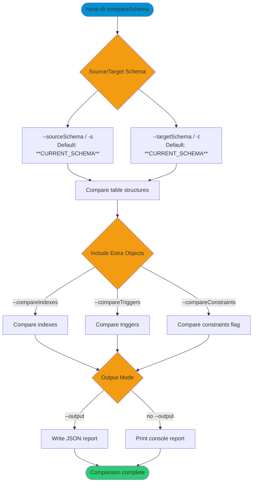

# compareSchema

> Command: `compareSchema`  
> Category: **Schema Tools**  
> Status: Production Ready

## Description

Compares schema structures between two schemas and reports structural differences. The command highlights table, column, index, and trigger differences to support migration validation, environment checks, and drift detection.

## Syntax

```bash
hana-cli compareSchema [options]
```

## Aliases

- `cmpschema`
- `schemaCompare`
- `compareschema`

## Command Diagram



## Parameters

### Positional Arguments

This command has no positional arguments.

### Options

| Option | Alias | Type | Default | Description |
|---|---|---|---|---|
| `--sourceSchema` | `-s` | string | `**CURRENT_SCHEMA**` | Source schema to compare. |
| `--targetSchema` | `-t` | string | `**CURRENT_SCHEMA**` | Target schema to compare. |
| `--tables` | `--tb` | string | - | Optional comma-separated table list parameter. |
| `--compareIndexes` | `--ci` | boolean | `true` | Include index comparison. |
| `--compareTriggers` | `--ct` | boolean | `true` | Include trigger comparison. |
| `--compareConstraints` | `--cc` | boolean | `true` | Constraint comparison toggle. |
| `--output` | `-o` | string | - | Write comparison output to a file (JSON). |
| `--timeout` | `--to` | number | `3600` | Operation timeout in seconds. |
| `--profile` | `-p` | string | - | Connection profile to use. |

### Connection Parameters

| Option | Alias | Type | Default | Description |
|---|---|---|---|---|
| `--admin` | `-a` | boolean | `false` | Use admin connection settings. |
| `--conn` | - | string | Config-dependent | Override connection file. |

### Troubleshooting

| Option | Alias | Type | Default | Description |
|---|---|---|---|---|
| `--disableVerbose` | `--quiet` | boolean | `false` | Reduce verbose output. |
| `--debug` | `-d` | boolean | `false` | Enable debug output. |

## Output Details

The comparison report includes:

### Table Comparison

- **Matching tables**: Tables that exist in both schemas with identical structure
- **Added tables**: Tables in target but not in source
- **Missing tables**: Tables in source but not in target
- **Column differences**:
  - Added columns
  - Missing columns
  - Type changes
  - Nullable constraint changes

### Index Comparison

- **Missing indexes**: Indexes in source but not in target
- **Extra indexes**: Indexes in target but not in source
- **Index structure changes**: Column order, uniqueness settings

### Trigger Comparison

- **Missing triggers**: Triggers in source but not in target
- **Extra triggers**: Triggers in target but not in source

### Constraint Comparison

The command exposes a `--compareConstraints` flag for schema-comparison workflows. Detailed constraint-diff output is currently limited compared to table/index/trigger reporting.

## Examples

### 1. Basic Schema Comparison

Compare two schemas:

```bash
hana-cli compareSchema -s PRODUCTION -t STAGING
```

### 2. Using a Table List Parameter

Pass a comma-separated table list parameter:

```bash
hana-cli compareSchema \
  -s PRODUCTION -t STAGING \
  --tables CUSTOMERS,ORDERS,PRODUCTS
```

### 3. Exclude Indexes and Triggers

Quick comparison focusing on table structure:

```bash
hana-cli compareSchema \
  -s PRODUCTION -t STAGING \
  --compareIndexes false \
  --compareTriggers false
```

### 4. Schema Comparison with Report Export

Save detailed comparison report:

```bash
hana-cli compareSchema \
  -s SOURCE_DB -t TARGET_DB \
  -o ./reports/schema_comparison.json
```

### 5. Pre-Migration Schema Validation

Verify schemas match before migration:

```bash
hana-cli compareSchema \
  -s LEGACY_SYSTEM -t NEW_SYSTEM
```

## Use Cases

### Pre-Migration Validation

Ensure target environment matches source before migration:

```bash
hana-cli compareSchema \
  -s CURRENT_PRODUCTION -t MIGRATION_TARGET \
  -o ./migration_check.json
```

### Environment Synchronization

Check if development, staging, and production are in sync:

```bash
hana-cli compareSchema -s DEV -t STAGING
hana-cli compareSchema -s STAGING -t PRODUCTION
```

### Schema Drift Detection

Monitor whether schemas have diverged:

```bash
hana-cli compareSchema \
  -s BASELINE_SCHEMA \
  -t CURRENT_SCHEMA \
  -o ./drift_report.json
```

### Incremental Deployment Verification

After applying schema changes, verify they match expected state:

```bash
hana-cli compareSchema \
  -s EXPECTED_STATE \
  -t DEPLOYED_STATE
```

## Migration Workflow Example

```bash
# 1. Compare schemas before migration
hana-cli compareSchema \
  -s LEGACY_SYSTEM -t NEW_SYSTEM \
  -o ./pre_migration_schema.json

# 2. Review report and address any differences

# 3. Apply any necessary schema corrections to NEW_SYSTEM

# 4. Re-run comparison to verify matching schemas
hana-cli compareSchema \
  -s LEGACY_SYSTEM -t NEW_SYSTEM \
  -o ./post_migration_schema.json

# 5. Compare data after applying schema changes
hana-cli compareData \
  -st CUSTOMER_DATA -ss LEGACY_SYSTEM \
  -tt CUSTOMER_DATA -ts NEW_SYSTEM \
  -k CUSTOMER_ID
```

## Performance Considerations

- **Table filtering parameter**: `--tables` is available as a command option for scoped workflows
- **Comparison scope**: Disable unnecessary comparisons (indexes, triggers) if not needed
- **Timeout**: Increase `--timeout` for very large schemas
- **Network latency**: Cross-database comparisons may be slower

## Common Schema Differences

### Expected Differences to Address

- Temporary tables or views not needed on target
- Development-only columns with prefixes like `DEV_*`
- Different naming conventions between environments
- Performance optimization columns/indexes in production

### Warning Signs

- Missing primary keys on replicated data
- Mismatched data types
- Missing foreign key constraints
- Orphaned indexes (can impact performance)

## Tips and Best Practices

1. **Baseline comparison**: Create a baseline schema comparison report for reference
2. **Automate checks**: Schedule periodic schema comparisons to catch drift early
3. **Document schema versions**: Keep schema comparison reports for audit trails
4. **Pre-deployment validation**: Always run schema comparison before production deployments
5. **Team communication**: Share comparison reports with team members to discuss changes
6. **Test environment changes**: Apply schema changes to test environment first, then compare with target
7. **Archive reports**: Keep historical comparison reports for troubleshooting

## Related Commands

- **`compareData`** - Compare data between tables
- **`schemaClone`** - Clone schema structures and optional data

See the [Commands Reference](../all-commands.md) for other commands in this category.

## See Also

- [Category: Schema Tools](..)
- [All Commands A-Z](../all-commands.md)
