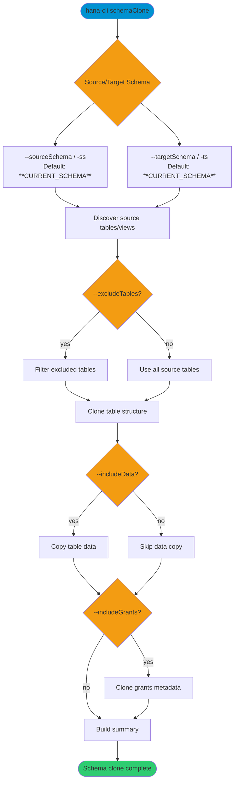

# schemaClone

> Command: `schemaClone`  
> Category: **Schema Tools**  
> Status: Production Ready

## Description

Clones schema tables (and optionally table data) from a source schema to a target schema. This is useful for creating development environments, backups, or sandbox schemas for testing.

## Syntax

```bash
hana-cli schemaClone [options]
```

## Aliases

- `schemaclone`
- `cloneSchema`
- `copyschema`

## Command Diagram



## Parameters

### Positional Arguments

This command has no positional arguments.

### Options

| Option | Alias | Type | Default | Description |
|---|---|---|---|---|
| `--sourceSchema` | `-ss` | string | `**CURRENT_SCHEMA**` | Source schema to clone from. |
| `--targetSchema` | `-ts` | string | `**CURRENT_SCHEMA**` | Target schema to clone to. |
| `--includeData` | `-id` | boolean | `false` | Copy table data in addition to structure. |
| `--includeGrants` | `-ig` | boolean | `false` | Include grant discovery/reporting workflow. |
| `--parallel` | `-par` | number | `1` | Accepted parallelism parameter for clone workflows. |
| `--excludeTables` | `-et` | string | - | Comma-separated tables to exclude. |
| `--dryRun` | `-dr`, `--preview` | boolean | `false` | Accepted preview flag for dry-run workflows. |
| `--timeout` | `--to` | number | `7200` | Operation timeout in seconds. |
| `--profile` | `-p` | string | - | Connection profile to use. |

### Connection Parameters

| Option | Alias | Type | Default | Description |
|---|---|---|---|---|
| `--admin` | `-a` | boolean | `false` | Use admin connection settings. |
| `--conn` | - | string | Config-dependent | Override connection file. |

### Troubleshooting

| Option | Alias | Type | Default | Description |
|---|---|---|---|---|
| `--disableVerbose` | `--quiet` | boolean | `false` | Reduce verbose output. |
| `--debug` | `-d` | boolean | `false` | Enable debug output. |

## Cloning Process

The command performs these steps:

1. **Schema Verification**: Checks if source schema exists
2. **Target Creation**: Creates target schema if it doesn't exist
3. **Table Discovery**: Lists all tables in source schema
4. **Table Filtering**: Applies exclude filter if specified
5. **Structure Cloning**: Creates table structures using `CREATE TABLE ... LIKE`
6. **Data Copying**: Copies data if `--includeData` specified
7. **View Cloning**: Identifies views (manual recreation may be needed)
8. **Grant Processing**: Reads grant metadata when `--includeGrants` is specified
9. **Summary Report**: Displays cloning statistics

## Object Types Cloned

### Automatically Cloned

- ✅ Tables (structure)
- ✅ Table data (if `--includeData`)
- ✅ Column definitions
- ✅ Primary keys
- ✅ Unique constraints

### Requires Manual Handling

- ⚠️ Views (DDL display only)
- ⚠️ Stored procedures
- ⚠️ Functions
- ⚠️ Sequences
- ⚠️ Synonyms
- ⚠️ Triggers
- ⚠️ Foreign key constraints
- ⚠️ Privilege replay (grant application)

## Output Format

```text
Starting schema clone from PRODUCTION to DEVELOPMENT
Creating target schema DEVELOPMENT
Found 25 table(s) to clone
Cloning table: CUSTOMERS
Copied 15,432 row(s) to table CUSTOMERS
Cloning table: ORDERS
Copied 89,765 row(s) to table ORDERS
Cloning table: PRODUCTS
Copied 3,421 row(s) to table PRODUCTS
...
Found 8 view(s) to clone
Cloning view: CUSTOMER_SUMMARY
View CUSTOMER_SUMMARY skipped (requires manual DDL conversion)
...
Schema clone complete. Source: PRODUCTION, Target: DEVELOPMENT, Tables: 25, Rows: 234,567

┌────────────────┬────────────────┬───────────────┬─────────────┬──────────────┬──────────────────┐
│ SOURCE_SCHEMA  │ TARGET_SCHEMA  │ TABLES_CLONED │ ROWS_COPIED │ DATA_INCLUDED│ GRANTS_INCLUDED  │
├────────────────┼────────────────┼───────────────┼─────────────┼──────────────┼──────────────────┤
│ PRODUCTION     │ DEVELOPMENT    │ 25            │ 234567      │ YES          │ NO               │
└────────────────┴────────────────┴───────────────┴─────────────┴──────────────┴──────────────────┘
```

## Examples

### 1. Basic Schema Clone (Structure Only)

Clone schema structure without data:

```bash
hana-cli schemaClone -ss PRODUCTION -ts DEVELOPMENT
```

### 2. Clone Schema with Data

Clone schema including all table data:

```bash
hana-cli schemaClone \
  -ss PRODUCTION \
  -ts DEV_SANDBOX \
  -id
```

### 3. Clone with Grants

Clone schema structure and security grants:

```bash
hana-cli schemaClone \
  -ss MAIN_SCHEMA \
  -ts BACKUP_SCHEMA \
  -ig
```

### 4. Full Clone with Data and Grants

Complete schema clone including everything:

```bash
hana-cli schemaClone \
  -ss PROD_SCHEMA \
  -ts TEST_SCHEMA \
  -id \
  -ig
```

### 5. Exclude Specific Tables

Clone schema but exclude temporary or log tables:

```bash
hana-cli schemaClone \
  -ss SALES_SCHEMA \
  -ts SALES_ARCHIVE \
  -id \
  -et TEMP_LOGS,DEBUG_TABLE,STAGING_DATA
```

### 6. Parallel Cloning for Performance

Use parallel operations for faster cloning:

```bash
hana-cli schemaClone \
  -ss LARGE_SCHEMA \
  -ts LARGE_SCHEMA_COPY \
  -id \
  -par 4
```

### 7. Extended Timeout for Large Schemas

Increase timeout for very large schemas:

```bash
hana-cli schemaClone \
  -ss BIG_DATA_SCHEMA \
  -ts BIG_DATA_BACKUP \
  -id \
  --timeout 14400
```

## Use Cases

1. **Development Environments**: Create dev/test copies of production schemas
2. **Schema Backup**: Quick schema-level backups before major changes
3. **Sandbox Creation**: Create isolated environments for testing
4. **Data Migration**: Move schema structure to different systems
5. **Schema Versioning**: Create timestamped schema snapshots
6. **Performance Testing**: Clone production structure for load testing

## Performance Considerations

- **Without Data** (`-id` not set): Very fast, structure-only copy
- **With Data** (`-id` set): Time depends on data volume
- **Parallel Operations** (`-par`): Can significantly speed up large schemas
- **Network Speed**: Affects data copy performance
- **Table Size**: Large tables take proportionally longer

## Prerequisites

- CREATE SCHEMA privilege (if target doesn't exist)
- SELECT privilege on source schema
- CREATE TABLE privilege on target schema
- INSERT privilege on target schema (if copying data)
- Sufficient disk space for cloned data

## Notes

- Target schema will be created if it doesn't exist
- If target schema exists, tables are added (existing tables not dropped)
- Views require manual DDL conversion due to schema name dependencies
- Foreign keys may need manual recreation after cloning
- Sequences need to be adjusted for current values
- Consider excluding large log or temporary tables
- Use appropriate timeout for schema size
- Indexes are created automatically with table structure
- Partitioning is preserved in table structure

## Troubleshooting Scenarios

### Error: Source schema not found

- Verify source schema name spelling and case
- Check database connection

### Error: Permission denied

- Ensure you have appropriate privileges
- May need SCHEMA OWNER or DBA role

### Timeout errors

- Increase timeout parameter
- Reduce parallel operations
- Exclude large tables

### Out of disk space

- Check available space before cloning large schemas
- Consider cloning without data first
- Exclude unnecessary tables

## Related Commands

- `schemas` - List available schemas.
- `tables` - Inspect tables in schemas.
- `export` - Export schema/table data.

See the [Commands Reference](../all-commands.md) for other commands in this category.

## See Also

- [Category: Schema Tools](..)
- [All Commands A-Z](../all-commands.md)
