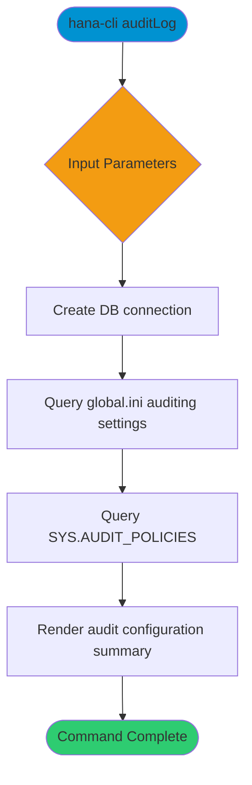

# auditLog

> Command: `auditLog`  
> Category: **Security**  
> Status: Production Ready

## Description

Review auditing configuration and audit policy metadata in SAP HANA. This command surfaces global auditing settings, policy definitions, and a summary of audit configuration status.

## Syntax

```bash
hana-cli auditLog [options]
```

## Aliases

- `audit`
- `auditlog`

## Command Diagram



## Parameters

### Positional Arguments

This command does not accept positional arguments.

### Options

| Option     | Alias   | Type    | Default | Description                                                         |
|------------|---------|---------|---------|---------------------------------------------------------------------|
| `--limit`  | `-l`    | number  | `100`   | Maximum number of audit entries to return.                          |
| `--user`   | `-u`    | string  | -       | Filter by audit user.                                               |
| `--action` | `-a`    | string  | -       | Filter by audited action.                                           |
| `--schema` | `-s`    | string  | -       | Filter by schema name.                                              |
| `--level`  | `--lvl` | string  | `all`   | Audit severity level. Choices: `all`, `CRITICAL`, `ERROR`, `WARNING`, `INFO` |
| `--days`   | `-d`    | number  | `7`     | Number of days to look back.                                        |

### Connection Parameters

| Option    | Alias | Type    | Default | Description                                      |
|-----------|-------|---------|---------|--------------------------------------------------|
| `--admin` | `-a`  | boolean | `false` | Connect via admin (default-env-admin.json)       |
| `--conn`  | -     | string  | -       | Connection filename to override default-env.json |

### Troubleshooting

| Option             | Alias     | Type    | Default | Description            |
|--------------------|-----------|---------|---------|------------------------|
| `--disableVerbose` | `--quiet` | boolean | `false` | Disable verbose output |
| `--debug`          | `-d`      | boolean | `false` | Enable debug output    |

For the runtime-generated option list, run:

```bash
hana-cli auditLog --help
```

## Examples

### Basic Usage

```bash
hana-cli auditLog --days 7 --level ERROR
```

Review audit configuration and focus on recent error-level activity.

## Related Commands

- `systemInfo` - System information overview
- `securityScan` - Scan for common security vulnerabilities

See the [Commands Reference](../all-commands.md) for other commands in this category.

## See Also

- [Category: Security](..)
- [All Commands A-Z](../all-commands.md)
