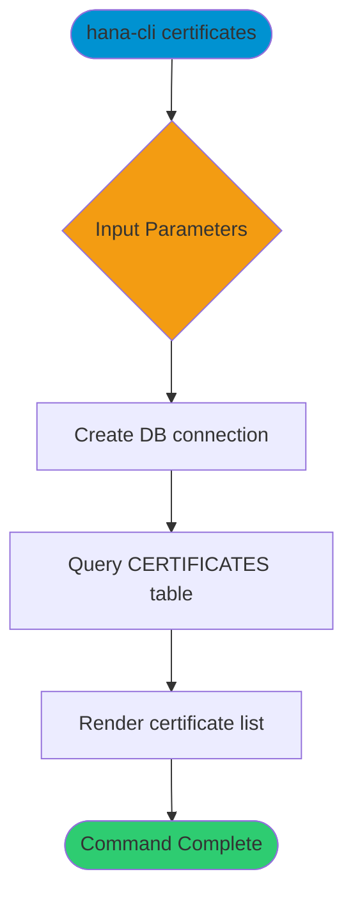
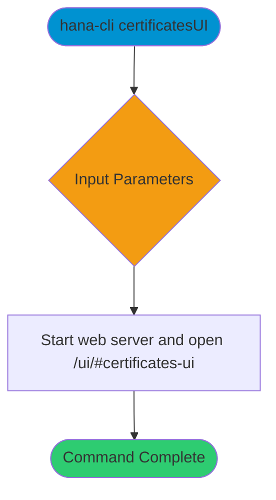

# certificates

> Command: `certificates`  
> Category: **Security**  
> Status: Production Ready

## Description

List system certificates registered in the SAP HANA certificate store.

## Syntax

```bash
hana-cli certificates [options]
```

## Aliases

- `cert`
- `certs`

## Command Diagram



## Parameters

### Positional Arguments

This command does not accept positional arguments.

### Options

This command does not define additional options beyond connection and troubleshooting parameters.

### Connection Parameters

| Option    | Alias | Type    | Default | Description                                      |
|-----------|-------|---------|---------|--------------------------------------------------|
| `--admin` | `-a`  | boolean | `false` | Connect via admin (default-env-admin.json)       |
| `--conn`  | -     | string  | -       | Connection filename to override default-env.json |

### Troubleshooting

| Option             | Alias     | Type    | Default | Description            |
|--------------------|-----------|---------|---------|------------------------|
| `--disableVerbose` | `--quiet` | boolean | `false` | Disable verbose output |
| `--debug`          | `-d`      | boolean | `false` | Enable debug output    |

For the runtime-generated option list, run:

```bash
hana-cli certificates --help
```

## Examples

### Basic Usage

```bash
hana-cli certificates
```

List the certificates stored in the system certificate store.

---

## certificatesUI (UI Variant)

> Command: `certificatesUI`  
> Status: Production Ready

### Description (certificatesUI)

Launch the web UI for browsing system certificates.

### Syntax (certificatesUI)

```bash
hana-cli certificatesUI [options]
```

### Aliases (certificatesUI)

- `certUI`
- `certsUI`
- `certificatesui`
- `listCertificatesUI`
- `listcertificatesui`

### Command Diagram (certificatesUI)



### Parameters (certificatesUI)

#### Positional Arguments (certificatesUI)

This command does not accept positional arguments.

#### Options (certificatesUI)

This command does not define additional options beyond connection and troubleshooting parameters.

#### Connection Parameters (certificatesUI)

| Option    | Alias | Type    | Default | Description                                      |
|-----------|-------|---------|---------|--------------------------------------------------|
| `--admin` | `-a`  | boolean | `false` | Connect via admin (default-env-admin.json)       |
| `--conn`  | -     | string  | -       | Connection filename to override default-env.json |

#### Troubleshooting (certificatesUI)

| Option             | Alias     | Type    | Default | Description            |
|--------------------|-----------|---------|---------|------------------------|
| `--disableVerbose` | `--quiet` | boolean | `false` | Disable verbose output |
| `--debug`          | `-d`      | boolean | `false` | Enable debug output    |

For the runtime-generated option list, run:

```bash
hana-cli certificatesUI --help
```

### Examples (certificatesUI)

```bash
hana-cli certificatesUI
```

Open the certificates browser UI in the local web server.

## Related Commands

- `certificates` - List system certificates in the CLI
- `encryptionStatus` - Check encryption status for data, log, backup, and network

See the [Commands Reference](../all-commands.md) for other commands in this category.

## See Also

- [Category: Security](..)
- [All Commands A-Z](../all-commands.md)
