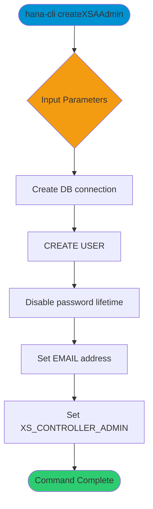

# createXSAAdmin

> Command: `createXSAAdmin`  
> Category: **Security**  
> Status: Production Ready

## Description

Create a new SAP HANA database user and configure it with XSA admin settings, including password lifetime configuration and XS controller admin parameters. This command requires sufficient privileges to create and alter users.

## Syntax

```bash
hana-cli createXSAAdmin [user] [password] [options]
```

## Aliases

- `cXSAAdmin`
- `cXSAA`
- `cxsaadmin`
- `cxsaa`

## Command Diagram



## Parameters

### Positional Arguments

| Parameter  | Type   | Description                     |
|------------|--------|---------------------------------|
| `user`     | string | User name to create.            |
| `password` | string | Initial password for the user.  |

### Options

| Option       | Alias | Type   | Default | Description         |
|--------------|-------|--------|---------|---------------------|
| `--user`     | `-u`  | string | -       | User name to create |
| `--password` | `-p`  | string | -       | Initial password    |

### Connection Parameters

| Option    | Alias | Type    | Default | Description                                      |
|-----------|-------|---------|---------|--------------------------------------------------|
| `--admin` | `-a`  | boolean | `false` | Connect via admin (default-env-admin.json)       |
| `--conn`  | -     | string  | -       | Connection filename to override default-env.json |

### Troubleshooting

| Option             | Alias     | Type    | Default | Description            |
|--------------------|-----------|---------|---------|------------------------|
| `--disableVerbose` | `--quiet` | boolean | `false` | Disable verbose output |
| `--debug`          | `-d`      | boolean | `false` | Enable debug output    |

For the runtime-generated option list, run:

```bash
hana-cli createXSAAdmin --help
```

## Examples

### Basic Usage

```bash
hana-cli createXSAAdmin --user admin --password MyPassword
```

Create a new XSA admin user named `admin`.

## Related Commands

- `users` - List database users
- `roles` - List roles and role metadata
- `createGroup` - Create a user group

See the [Commands Reference](../all-commands.md) for other commands in this category.

## See Also

- [Category: Security](..)
- [All Commands A-Z](../all-commands.md)
