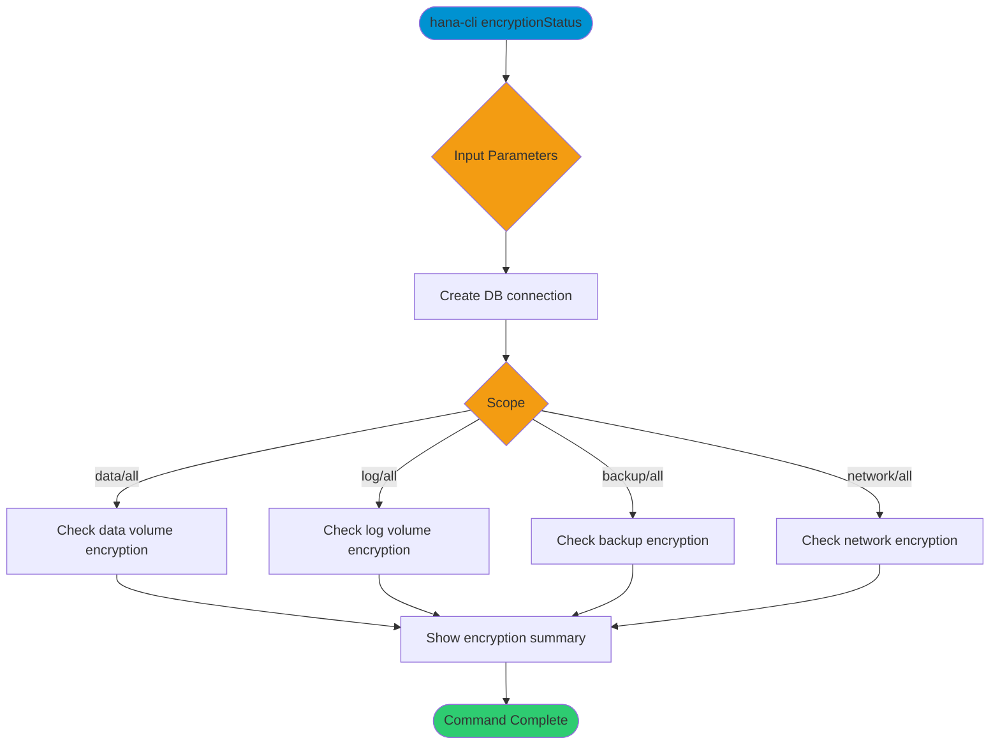

# encryptionStatus

> Command: `encryptionStatus`  
> Category: **Security**  
> Status: Production Ready

## Description

Check encryption configuration and status across data volumes, log volumes, backups, and network communication.

## Syntax

```bash
hana-cli encryptionStatus [options]
```

## Aliases

- `encryption`
- `encrypt`

## Command Diagram



## Parameters

### Positional Arguments

This command does not accept positional arguments.

### Options

| Option     | Alias | Type    | Default | Description                                                         |
|------------|-------|---------|---------|---------------------------------------------------------------------|
| `--scope`  | `-s`  | string  | `all`   | Encryption scope to inspect. Choices: `all`, `data`, `log`, `backup`, `network` |
| `--details`| `-d`  | boolean | `false` | Include detailed tables for volumes and recent backups.             |

### Connection Parameters

| Option    | Alias | Type    | Default | Description                                      |
|-----------|-------|---------|---------|--------------------------------------------------|
| `--admin` | `-a`  | boolean | `false` | Connect via admin (default-env-admin.json)       |
| `--conn`  | -     | string  | -       | Connection filename to override default-env.json |

### Troubleshooting

| Option             | Alias     | Type    | Default | Description            |
|--------------------|-----------|---------|---------|------------------------|
| `--disableVerbose` | `--quiet` | boolean | `false` | Disable verbose output |
| `--debug`          | `-d`      | boolean | `false` | Enable debug output    |

For the runtime-generated option list, run:

```bash
hana-cli encryptionStatus --help
```

## Examples

### Basic Usage

```bash
hana-cli encryptionStatus --scope backup --details
```

Inspect backup encryption configuration and include recent backup details.

## Related Commands

- `certificates` - List system certificates
- `healthCheck` - Run general health checks

See the [Commands Reference](../all-commands.md) for other commands in this category.

## See Also

- [Category: Security](..)
- [All Commands A-Z](../all-commands.md)
