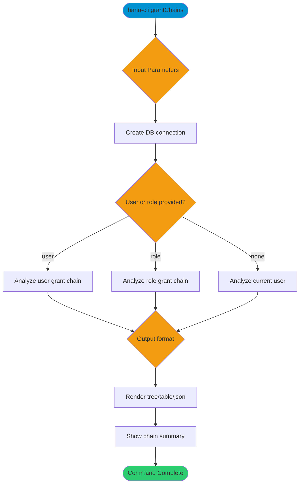

# grantChains

> Command: `grantChains`  
> Category: **Security**  
> Status: Production Ready

## Description

Visualize privilege inheritance chains for a user or role, including nested roles and privilege summaries.

## Syntax

```bash
hana-cli grantChains [options]
```

## Aliases

- `grants`
- `grantchain`

## Command Diagram



## Parameters

### Positional Arguments

This command does not accept positional arguments.

### Options

| Option    | Alias | Type   | Default | Description                 |
|-----------|-------|--------|---------|-----------------------------|
| `--user`  | `-u`  | string | -       | Target user to analyze.     |
| `--role`  | `-r`  | string | -       | Target role to analyze.     |
| `--depth` | `-d`  | number | `5`     | Maximum depth of the chain. |

### Output Options

| Option     | Alias | Type   | Default | Description                                           |
|------------|-------|--------|---------|-------------------------------------------------------|
| `--format` | `-f`  | string | `tree`  | Output format. Choices: `tree`, `table`, `json`       |

### Connection Parameters

| Option    | Alias | Type    | Default | Description                                      |
|-----------|-------|---------|---------|--------------------------------------------------|
| `--admin` | `-a`  | boolean | `false` | Connect via admin (default-env-admin.json)       |
| `--conn`  | -     | string  | -       | Connection filename to override default-env.json |

### Troubleshooting

| Option             | Alias     | Type    | Default | Description            |
|--------------------|-----------|---------|---------|------------------------|
| `--disableVerbose` | `--quiet` | boolean | `false` | Disable verbose output |
| `--debug`          | `-d`      | boolean | `false` | Enable debug output    |

For the runtime-generated option list, run:

```bash
hana-cli grantChains --help
```

## Examples

### Basic Usage

```bash
hana-cli grantChains --user DBUSER
```

Visualize the grant chain for `DBUSER`.

## Related Commands

- `privilegeAnalysis` - Analyze user privileges and suggest least privilege
- `privilegeError` - Get insufficient privilege error details
- `roles` - List roles and role metadata

See the [Commands Reference](../all-commands.md) for other commands in this category.

## See Also

- [Category: Security](..)
- [All Commands A-Z](../all-commands.md)
