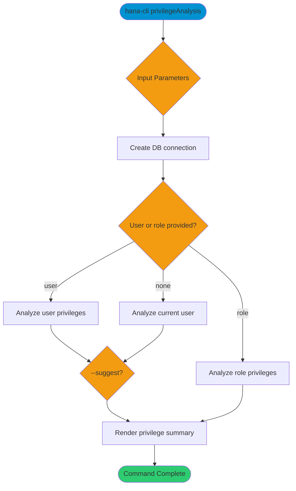

# privilegeAnalysis

> Command: `privilegeAnalysis`  
> Category: **Security**  
> Status: Production Ready

## Description

Analyze user or role privileges and generate least-privilege recommendations based on granted system, object, and role privileges.

## Syntax

```bash
hana-cli privilegeAnalysis [options]
```

## Aliases

- `privanalysis`
- `privanalyze`

## Command Diagram



## Parameters

### Positional Arguments

This command does not accept positional arguments.

### Options

| Option        | Alias     | Type    | Default | Description                                 |
|---------------|-----------|---------|---------|---------------------------------------------|
| `--user`      | `-u`      | string  | -       | Target user to analyze.                      |
| `--role`      | `-r`      | string  | -       | Target role to analyze.                      |
| `--showUnused`| `--unused`| boolean | `false` | Include unused privileges in the output.     |
| `--suggest`   | `-s`      | boolean | `true`  | Suggest least-privilege recommendations.     |

### Connection Parameters

| Option    | Alias | Type    | Default | Description                                      |
|-----------|-------|---------|---------|--------------------------------------------------|
| `--admin` | `-a`  | boolean | `false` | Connect via admin (default-env-admin.json)       |
| `--conn`  | -     | string  | -       | Connection filename to override default-env.json |

### Troubleshooting

| Option             | Alias     | Type    | Default | Description            |
|--------------------|-----------|---------|---------|------------------------|
| `--disableVerbose` | `--quiet` | boolean | `false` | Disable verbose output |
| `--debug`          | `-d`      | boolean | `false` | Enable debug output    |

For the runtime-generated option list, run:

```bash
hana-cli privilegeAnalysis --help
```

## Examples

### Basic Usage

```bash
hana-cli privilegeAnalysis --user TESTUSER --suggest
```

Analyze `TESTUSER` privileges and include least-privilege suggestions.

## Related Commands

- `roles` - List roles and role metadata
- `users` - List database users
- `grantChains` - Visualize privilege inheritance chains

See the [Commands Reference](../all-commands.md) for other commands in this category.

## See Also

- [Category: Security](..)
- [All Commands A-Z](../all-commands.md)
