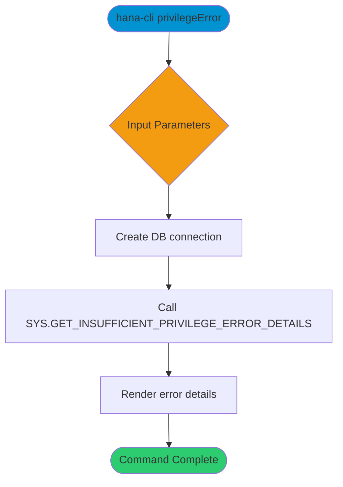

# privilegeError

> Command: `privilegeError`  
> Category: **Security**  
> Status: Production Ready

## Description

Retrieve details for an insufficient privilege error using its GUID by calling the system procedure `GET_INSUFFICIENT_PRIVILEGE_ERROR_DETAILS`.

## Syntax

```bash
hana-cli privilegeError [guid] [options]
```

## Aliases

- `pe`
- `privilegeerror`
- `privilegerror`
- `getInsuffficientPrivilegeErrorDetails`

## Command Diagram



## Parameters

### Positional Arguments

| Parameter | Type   | Description                 |
|-----------|--------|-----------------------------|
| `guid`    | string | Error GUID to investigate.  |

### Options

| Option   | Alias        | Type   | Default | Description        |
|----------|--------------|--------|---------|--------------------|
| `--guid` | `-g`, `--error` | string | -       | Error GUID value.  |

### Connection Parameters

| Option    | Alias | Type    | Default | Description                                      |
|-----------|-------|---------|---------|--------------------------------------------------|
| `--admin` | `-a`  | boolean | `false` | Connect via admin (default-env-admin.json)       |
| `--conn`  | -     | string  | -       | Connection filename to override default-env.json |

### Troubleshooting

| Option             | Alias     | Type    | Default | Description            |
|--------------------|-----------|---------|---------|------------------------|
| `--disableVerbose` | `--quiet` | boolean | `false` | Disable verbose output |
| `--debug`          | `-d`      | boolean | `false` | Enable debug output    |

For the runtime-generated option list, run:

```bash
hana-cli privilegeError --help
```

## Examples

### Basic Usage

```bash
hana-cli privilegeError --guid <error-guid>
```

Lookup details for the specified insufficient privilege error.

## Related Commands

- `grantChains` - Visualize privilege inheritance chains
- `privilegeAnalysis` - Analyze user privileges and suggest least privilege

See the [Commands Reference](../all-commands.md) for other commands in this category.

## See Also

- [Category: Security](..)
- [All Commands A-Z](../all-commands.md)
