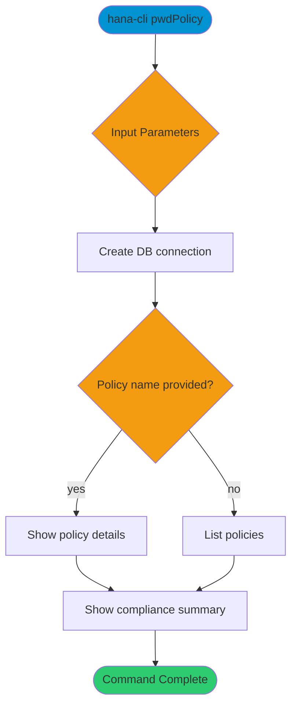

# pwdPolicy

> Command: `pwdPolicy`  
> Category: **Security**  
> Status: Production Ready

## Description

View password policy summaries and compliance information. You can list policies, inspect a specific policy name, and include policy user details.

## Syntax

```bash
hana-cli pwdPolicy [options]
```

## Aliases

- `pwdpolicy`
- `passpolicies`

## Command Diagram



## Parameters

### Positional Arguments

This command does not accept positional arguments.

### Options

| Option      | Alias | Type    | Default | Description                         |
|-------------|-------|---------|---------|-------------------------------------|
| `--policy`  | `-p`  | string  | -       | Specific policy name to inspect.    |
| `--list`    | `-l`  | boolean | `false` | List policies.                       |
| `--users`   | `-u`  | boolean | `false` | Show users affected by the policy.   |
| `--details` | `-d`  | boolean | `false` | Include detailed policy information. |

### Connection Parameters

| Option    | Alias | Type    | Default | Description                                      |
|-----------|-------|---------|---------|--------------------------------------------------|
| `--admin` | `-a`  | boolean | `false` | Connect via admin (default-env-admin.json)       |
| `--conn`  | -     | string  | -       | Connection filename to override default-env.json |

### Troubleshooting

| Option             | Alias     | Type    | Default | Description            |
|--------------------|-----------|---------|---------|------------------------|
| `--disableVerbose` | `--quiet` | boolean | `false` | Disable verbose output |
| `--debug`          | `-d`      | boolean | `false` | Enable debug output    |

For the runtime-generated option list, run:

```bash
hana-cli pwdPolicy --help
```

## Examples

### Basic Usage

```bash
hana-cli pwdPolicy --list --details
```

List password policies with detailed output.

## Related Commands

- `users` - List database users
- `inspectUser` - Inspect user metadata and privileges

See the [Commands Reference](../all-commands.md) for other commands in this category.

## See Also

- [Category: Security](..)
- [All Commands A-Z](../all-commands.md)
