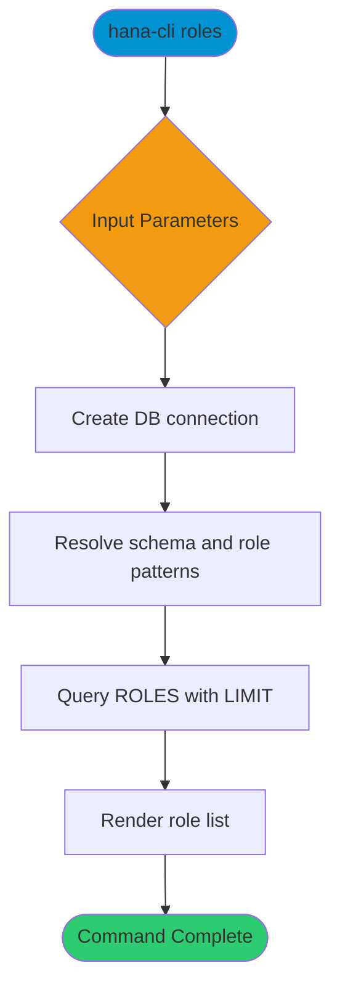

# roles

> Command: `roles`  
> Category: **Security**  
> Status: Production Ready

## Description

List database roles with optional schema and role pattern filters.

## Syntax

```bash
hana-cli roles [schema] [role] [options]
```

## Aliases

- `r`
- `listRoles`
- `listroles`

## Command Diagram



## Parameters

### Positional Arguments

| Parameter | Type   | Description                                  |
|-----------|--------|----------------------------------------------|
| `schema`  | string | Schema filter. Default: `**CURRENT_SCHEMA**` |
| `role`    | string | Role name pattern. Default: `*`              |

### Options

| Option     | Alias | Type   | Default              | Description                |
|------------|-------|--------|----------------------|----------------------------|
| `--role`   | `-r`  | string | `*`                  | Role name pattern.         |
| `--schema` | `-s`  | string | `**CURRENT_SCHEMA**` | Schema filter.             |
| `--limit`  | `-l`  | number | `200`                | Maximum number of results. |
| `--profile`| `-p`  | string | -                    | CDS Profile.               |

### Connection Parameters

| Option    | Alias | Type    | Default | Description                                      |
|-----------|-------|---------|---------|--------------------------------------------------|
| `--admin` | `-a`  | boolean | `false` | Connect via admin (default-env-admin.json)       |
| `--conn`  | -     | string  | -       | Connection filename to override default-env.json |

### Troubleshooting

| Option             | Alias     | Type    | Default | Description            |
|--------------------|-----------|---------|---------|------------------------|
| `--disableVerbose` | `--quiet` | boolean | `false` | Disable verbose output |
| `--debug`          | `-d`      | boolean | `false` | Enable debug output    |

For the runtime-generated option list, run:

```bash
hana-cli roles --help
```

## Special Default Values

| Token               | Resolves To               | Description                           |
|---------------------|---------------------------|---------------------------------------|
| `**CURRENT_SCHEMA**`| Current user's schema     | Default for schema parameters.        |
| `*`                 | All matches               | Wildcard pattern for role names.      |

## Wildcard Pattern Support

This command supports wildcard patterns for role names.

### Pattern Types

**Asterisk (`*`) - file-system style:**

- `ROLE_*` matches roles starting with `ROLE_`
- `*_ADMIN` matches roles ending in `_ADMIN`

### Pattern Examples

```bash
hana-cli roles --role "*_ADMIN" --schema SECURITY
```

Match all admin roles in the `SECURITY` schema.

## Examples

### Basic Usage

```bash
hana-cli roles --role myRole --schema MYSCHEMA
```

List roles matching `myRole` in `MYSCHEMA`.

## Related Commands

- `users` - List database users
- `inspectUser` - Inspect user metadata and privileges
- `grantChains` - Visualize privilege inheritance chains

See the [Commands Reference](../all-commands.md) for other commands in this category.

## See Also

- [Category: Security](..)
- [All Commands A-Z](../all-commands.md)
