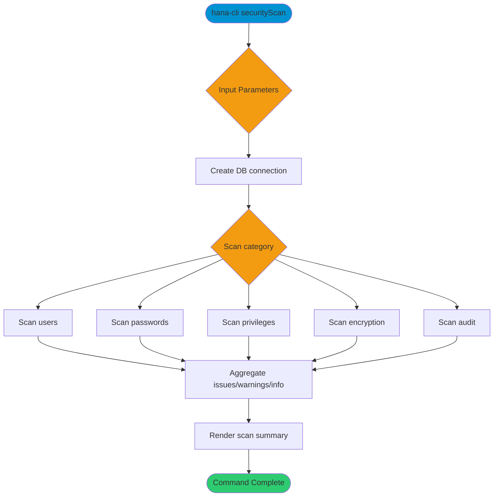

# securityScan

> Command: `securityScan`  
> Category: **Security**  
> Status: Production Ready

## Description

Scan for common security issues across users, passwords, privileges, encryption, and auditing. Optionally include detailed findings and attempt automated fixes (where available).

## Syntax

```bash
hana-cli securityScan [options]
```

## Aliases

- `secscan`
- `scan`

## Command Diagram



## Parameters

### Positional Arguments

This command does not accept positional arguments.

### Options

| Option       | Alias | Type    | Default | Description                                                              |
|--------------|-------|---------|---------|--------------------------------------------------------------------------|
| `--category` | `-c`  | string  | `all`   | Scan category. Choices: `all`, `users`, `passwords`, `privileges`, `encryption`, `audit` |
| `--detailed` | `-d`  | boolean | `false` | Include informational findings.                                          |
| `--fix`      | `-f`  | boolean | `false` | Attempt automated fixes when available.                                  |

### Connection Parameters

| Option    | Alias | Type    | Default | Description                                      |
|-----------|-------|---------|---------|--------------------------------------------------|
| `--admin` | `-a`  | boolean | `false` | Connect via admin (default-env-admin.json)       |
| `--conn`  | -     | string  | -       | Connection filename to override default-env.json |

### Troubleshooting

| Option             | Alias     | Type    | Default | Description            |
|--------------------|-----------|---------|---------|------------------------|
| `--disableVerbose` | `--quiet` | boolean | `false` | Disable verbose output |
| `--debug`          | `-d`      | boolean | `false` | Enable debug output    |

For the runtime-generated option list, run:

```bash
hana-cli securityScan --help
```

## Examples

### Basic Usage

```bash
hana-cli securityScan --category all --detailed
```

Run a full security scan and include informational findings.

## Related Commands

- `pwdPolicy` - Review password policy summaries
- `users` - List database users
- `healthCheck` - Run general health checks

See the [Commands Reference](../all-commands.md) for other commands in this category.

## See Also

- [Category: Security](..)
- [All Commands A-Z](../all-commands.md)
