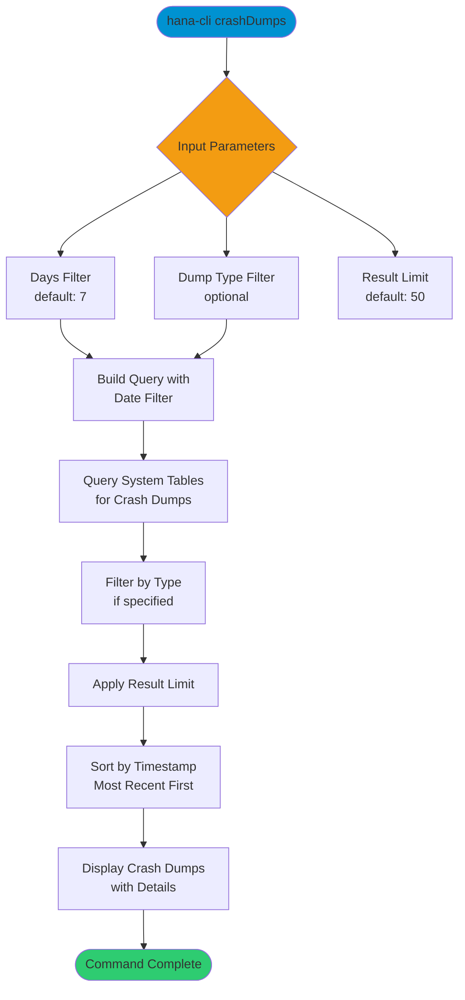

# crashDumps

> Command: `crashDumps`  
> Category: **System Admin**  
> Status: Production Ready

## Description

List and analyze crash dump files from the SAP HANA system. This command helps identify system crashes, trace files, and diagnostic dumps within a specified time period. Useful for troubleshooting stability issues and system failures.

## Syntax

```bash
hana-cli crashDumps [options]
```

## Aliases

- `crash`
- `cd`

## Command Diagram



## Parameters

### Options

| Option   | Alias | Type   | Default | Description                                           |
|----------|-------|--------|---------|-------------------------------------------------------|
| `--days` | `-d`  | number | `7`     | Number of days to look back for crash dumps           |
| `--type` | `-t`  | string | -       | Filter by crash dump type (optional)                  |
| `--limit`| `-l`  | number | `50`    | Maximum number of crash dumps to return               |

### Connection Parameters

| Option    | Alias | Type    | Default | Description                                          |
|-----------|-------|---------|---------|------------------------------------------------------|
| `--admin` | `-a`  | boolean | `false` | Connect via admin (default-env-admin.json)           |
| `--conn`  | -     | string  | -       | Connection filename to override default-env.json     |

### Troubleshooting

| Option              | Alias     | Type    | Default | Description                                                                                              |
|---------------------|-----------|---------|---------|----------------------------------------------------------------------------------------------------------|
| `--disableVerbose`  | `--quiet` | boolean | `false` | Disable verbose output - removes all extra output that is only helpful to human readable interface       |
| `--debug`           | `-d`      | boolean | `false` | Debug hana-cli itself by adding output of LOTS of intermediate details                                   |

## Examples

### Recent Crash Dumps

```bash
hana-cli crashDumps --days 7
```

List all crash dumps from the last 7 days.

### Extended Time Period

```bash
hana-cli crashDumps --days 30 --limit 100
```

List up to 100 crash dumps from the last 30 days.

### Filter by Type

```bash
hana-cli crashDumps --type "indexserver" --days 14
```

List only indexserver crash dumps from the last 14 days.

## Related Commands

See the [Commands Reference](../all-commands.md) for other commands in this category.

## See Also

- [Category: System Admin](..)
- [diagnose](./diagnose.md) - Comprehensive system diagnostics
- [healthCheck](./health-check.md) - Database health assessment
- [All Commands A-Z](../all-commands.md)
