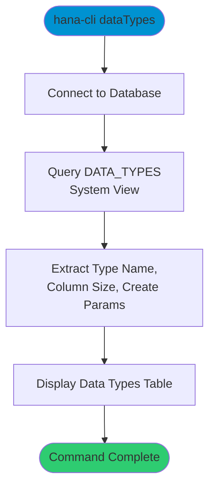

# dataTypes

> Command: `dataTypes`  
> Category: **System Admin**  
> Status: Production Ready

## Description

Display all available data types in SAP HANA from the `DATA_TYPES` system view. This command shows type names, column sizes, and creation parameters for each supported data type, useful for schema design and column type selection.

## Syntax

```bash
hana-cli dataTypes [options]
```

## Aliases

- `dt`
- `datatypes`
- `dataType`
- `datatype`

## Command Diagram



## Parameters

### Connection Parameters

| Option    | Alias | Type    | Default | Description                                          |
|-----------|-------|---------|---------|------------------------------------------------------|
| `--admin` | `-a`  | boolean | `false` | Connect via admin (default-env-admin.json)           |
| `--conn`  | -     | string  | -       | Connection filename to override default-env.json     |

### Troubleshooting

| Option              | Alias     | Type    | Default | Description                                                                                              |
|---------------------|-----------|---------|---------|----------------------------------------------------------------------------------------------------------|
| `--disableVerbose`  | `--quiet` | boolean | `false` | Disable verbose output - removes all extra output that is only helpful to human readable interface       |
| `--debug`           | `-d`      | boolean | `false` | Debug hana-cli itself by adding output of LOTS of intermediate details                                   |

## Examples

### List All Data Types

```bash
hana-cli dataTypes
```

Display all SAP HANA data types with their specifications.

---

## dataTypesUI (UI Variant)

> Command: `dataTypesUI`  
> Status: Production Ready

**Description:** Execute dataTypesUI command - UI version for listing data types

**Syntax:**

```bash
hana-cli dataTypesUI [options]
```

**Aliases:**

- `dtui`
- `datatypesUI`
- `dataTypeUI`
- `datatypeui`
- `datatypesui`

**Parameters:**

For a complete list of parameters and options, use:

```bash
hana-cli dataTypesUI --help
```

**Example Usage:**

```bash
hana-cli dataTypesUI
```

Execute the command

## Related Commands

See the [Commands Reference](../all-commands.md) for other commands in this category.

## See Also

- [Category: System Tools](..)
- [All Commands A-Z](../all-commands.md)
