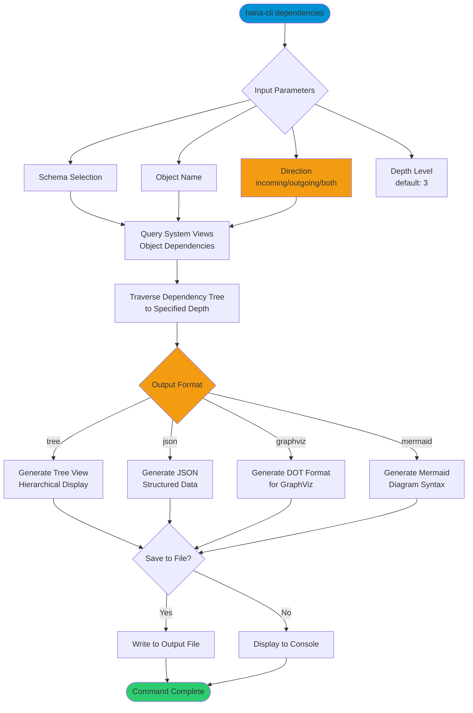

# dependencies

> Command: `dependencies`  
> Category: **System Admin**  
> Status: Production Ready

## Description

Generate and visualize object dependency graphs for database objects. This command analyzes relationships between tables, views, procedures, and other database objects, showing incoming and outgoing dependencies. Supports multiple output formats including tree, JSON, GraphViz, and Mermaid diagrams.

## Syntax

```bash
hana-cli dependencies [options]
```

## Aliases

- `deps`
- `depend`
- `dependency-graph`
- `relationships`

## Command Diagram



## Parameters

### Options

| Option               | Alias   | Type    | Default | Description                                                                                          |
|----------------------|---------|---------|---------|------------------------------------------------------------------------------------------------------|
| `--schema`           | `-s`    | string  | -       | Schema name to analyze                                                                               |
| `--object`           | `-o`    | string  | -       | Object name to analyze dependencies for                                                              |
| `--direction`        | `--dir` | string  | `both`  | Dependency direction. Choices: `incoming`, `outgoing`, `both`                                        |
| `--depth`            | `--lvl` | number  | `3`     | Maximum depth level for dependency traversal                                                         |
| `--output`           | `--out` | string  | -       | Output file path (if not specified, displays to console)                                             |
| `--format`           | `-f`    | string  | `tree`  | Output format. Choices: `tree`, `json`, `graphviz`, `mermaid`                                        |
| `--includeViews`     | `--iv`  | boolean | `true`  | Include views in dependency graph                                                                    |
| `--includeProcedures`| `--ip`  | boolean | `true`  | Include procedures in dependency graph                                                               |

### Connection Parameters

| Option    | Alias | Type    | Default | Description                                          |
|-----------|-------|---------|---------|------------------------------------------------------|
| `--admin` | `-a`  | boolean | `false` | Connect via admin (default-env-admin.json)           |
| `--conn`  | -     | string  | -       | Connection filename to override default-env.json     |

### Troubleshooting

| Option              | Alias     | Type    | Default | Description                                                                                              |
|---------------------|-----------|---------|---------|----------------------------------------------------------------------------------------------------------|
| `--disableVerbose`  | `--quiet` | boolean | `false` | Disable verbose output - removes all extra output that is only helpful to human readable interface       |
| `--debug`           | `-d`      | boolean | `false` | Debug hana-cli itself by adding output of LOTS of intermediate details                                   |

## Examples

### Analyze Object Dependencies

```bash
hana-cli dependencies --schema MYSCHEMA --object MY_TABLE
```

Show all dependencies (both incoming and outgoing) for MY_TABLE in tree format.

### Outgoing Dependencies Only

```bash
hana-cli dependencies --schema MYSCHEMA --object MY_VIEW --direction outgoing
```

Show only outgoing dependencies (what MY_VIEW depends on).

### Generate Mermaid Diagram

```bash
hana-cli dependencies --schema MYSCHEMA --object MY_PROC --format mermaid --output deps.md
```

Generate a Mermaid diagram of dependencies and save to deps.md file.

### Deep Dependency Analysis

```bash
hana-cli dependencies --schema MYSCHEMA --object MY_TABLE --depth 5 --format json
```

Analyze dependencies up to 5 levels deep and output as JSON.

## Related Commands

See the [Commands Reference](../all-commands.md) for other commands in this category.

## See Also

- [Category: System Admin](..)
- [All Commands A-Z](../all-commands.md)
