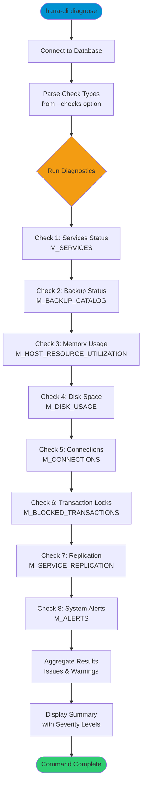

# diagnose

> Command: `diagnose`  
> Category: **System Admin**  
> Status: Production Ready

## Description

Run comprehensive system diagnostics on the SAP HANA database. This command performs multiple health checks including service status, backup verification, memory usage, disk space, connection limits, transaction locks, replication status, and alert monitoring. Results are categorized by severity (critical, warning, info) to help identify potential issues.

## Syntax

```bash
hana-cli diagnose [options]
```

## Aliases

- `diag`

## Command Diagram



## Parameters

### Options

| Option     | Alias | Type   | Default | Description                            |
|------------|-------|--------|---------|----------------------------------------|
| `--checks` | `-c`  | string | `all`   | Comma-separated list of checks to run: `all`, `services`, `backup`, `memory`, `disk`, `connections`, `locks`, `replication`, `alerts` |
| `--limit`  | `-l`  | number | `50`    | Maximum number of results per check    |

### Connection Parameters

| Option    | Alias | Type    | Default | Description                                          |
|-----------|-------|---------|---------|------------------------------------------------------|
| `--admin` | `-a`  | boolean | `false` | Connect via admin (default-env-admin.json)           |
| `--conn`  | -     | string  | -       | Connection filename to override default-env.json     |

### Troubleshooting

| Option              | Alias     | Type    | Default | Description                                                                                              |
|---------------------|-----------|---------|---------|----------------------------------------------------------------------------------------------------------|
| `--disableVerbose`  | `--quiet` | boolean | `false` | Disable verbose output - removes all extra output that is only helpful to human readable interface       |
| `--debug`           | `-d`      | boolean | `false` | Debug hana-cli itself by adding output of LOTS of intermediate details                                   |

## Examples

### Run All Diagnostics

```bash
hana-cli diagnose --checks all
```

Run all available diagnostic checks and display a comprehensive system health report.

### Check Specific Systems

```bash
hana-cli diagnose --checks services,backup,memory
```

Run only service status, backup status, and memory usage checks.

### Quick Disk and Connection Check

```bash
hana-cli diagnose --checks disk,connections --limit 25
```

Check disk space and active connections with a limit of 25 results per check.

## Related Commands

See the [Commands Reference](../all-commands.md) for other commands in this category.

## See Also

- [Category: System Admin](..)
- [healthCheck](./health-check.md) - Comprehensive database health assessment
- [systemInfo](./system-info.md) - Display system information
- [status](./status.md) - Connection status
- [All Commands A-Z](../all-commands.md)
