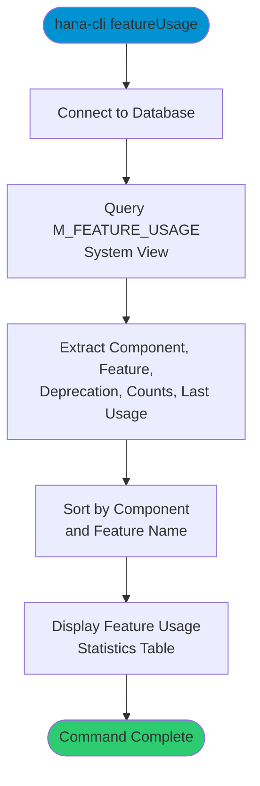

# featureUsage

> Command: `featureUsage`  
> Category: **System Admin**  
> Status: Production Ready

## Description

Display usage statistics for SAP HANA features from the `M_FEATURE_USAGE` system view. This command shows which features are being used, their call counts, object counts, deprecation status, and last usage details including user, application, and timestamp.

## Syntax

```bash
hana-cli featureUsage [options]
```

## Aliases

- `fu`
- `FeaturesUsage`

## Command Diagram



## Parameters

### Connection Parameters

| Option    | Alias | Type    | Default | Description                                          |
|-----------|-------|---------|---------|------------------------------------------------------|
| `--admin` | `-a`  | boolean | `false` | Connect via admin (default-env-admin.json)           |
| `--conn`  | -     | string  | -       | Connection filename to override default-env.json     |

### Troubleshooting

| Option              | Alias     | Type    | Default | Description                                                                                              |
|---------------------|-----------|---------|---------|----------------------------------------------------------------------------------------------------------|
| `--disableVerbose`  | `--quiet` | boolean | `false` | Disable verbose output - removes all extra output that is only helpful to human readable interface       |
| `--debug`           | `-d`      | boolean | `false` | Debug hana-cli itself by adding output of LOTS of intermediate details                                   |

## Examples

### View Feature Usage Statistics

```bash
hana-cli featureUsage
```

Display usage statistics for all SAP HANA features including call counts, object counts, deprecation status, and last usage details.

---

## featureUsageUI (UI Variant)

> Command: `featureUsageUI`  
> Status: Production Ready

**Description:** Execute featureUsageUI command - UI version for feature usage statistics

**Syntax:**

```bash
hana-cli featureUsageUI [options]
```

**Aliases:**

- `fuui`
- `featureusageui`
- `FeaturesUsageUI`
- `featuresusageui`

**Parameters:**

For a complete list of parameters and options, use:

```bash
hana-cli featureUsageUI --help
```

**Example Usage:**

```bash
hana-cli featureUsageUI
```

Execute the command

## Related Commands

See the [Commands Reference](../all-commands.md) for other commands in this category.

## See Also

- [Category: System Tools](..)
- [All Commands A-Z](../all-commands.md)
