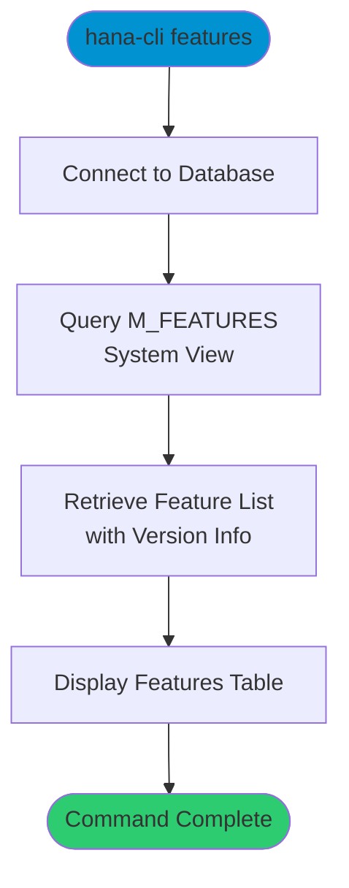

# features

> Command: `features`  
> Category: **System Admin**  
> Status: Production Ready

## Description

Display all available SAP HANA features and their version information from the `M_FEATURES` system view. This command provides details about installed features, components, and their status.

## Syntax

```bash
hana-cli features [options]
```

## Aliases

- `fe`
- `Features`

## Command Diagram



## Parameters

### Connection Parameters

| Option    | Alias | Type    | Default | Description                                          |
|-----------|-------|---------|---------|------------------------------------------------------|
| `--admin` | `-a`  | boolean | `false` | Connect via admin (default-env-admin.json)           |
| `--conn`  | -     | string  | -       | Connection filename to override default-env.json     |

### Troubleshooting

| Option              | Alias     | Type    | Default | Description                                                                                              |
|---------------------|-----------|---------|---------|----------------------------------------------------------------------------------------------------------|
| `--disableVerbose`  | `--quiet` | boolean | `false` | Disable verbose output - removes all extra output that is only helpful to human readable interface       |
| `--debug`           | `-d`      | boolean | `false` | Debug hana-cli itself by adding output of LOTS of intermediate details                                   |

## Examples

### List All Features

```bash
hana-cli features
```

Display all installed SAP HANA features and their version information.

---

## featuresUI (UI Variant)

> Command: `featuresUI`  
> Status: Production Ready

**Description:** Execute featuresUI command - UI version for listing SAP HANA features and version

**Syntax:**

```bash
hana-cli featuresUI [options]
```

**Aliases:**

- `feui`
- `featuresui`
- `FeaturesUI`

**Parameters:**

For a complete list of parameters and options, use:

```bash
hana-cli featuresUI --help
```

**Example Usage:**

```bash
hana-cli featuresUI
```

Execute the command

## Related Commands

See the [Commands Reference](../all-commands.md) for other commands in this category.

## See Also

- [Category: System Tools](..)
- [All Commands A-Z](../all-commands.md)
