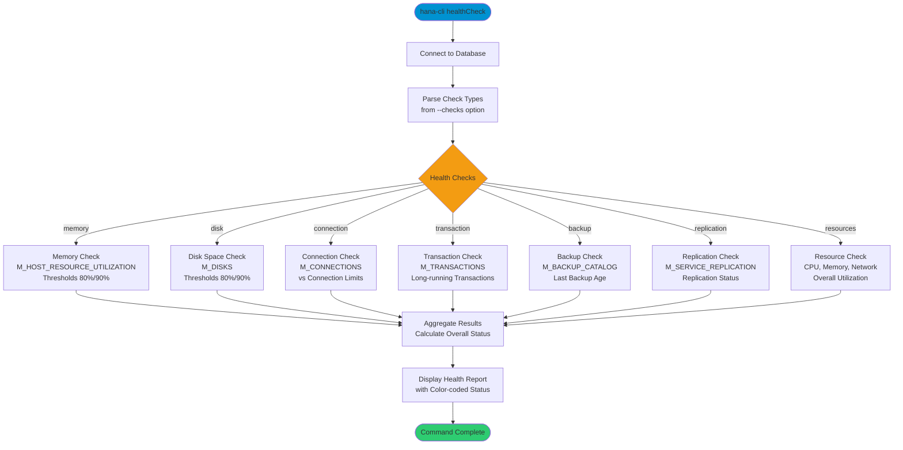

# healthCheck

> Command: `healthCheck`  
> Category: **System Admin**  
> Status: Production Ready

## Description

Perform a comprehensive database health assessment by running multiple diagnostic checks on memory, disk space, connections, transactions, backups, replication, and resource utilization. Results are categorized by severity (HEALTHY, WARNING, CRITICAL) with an overall health status.

## Syntax

```bash
hana-cli healthCheck [options]
```

## Aliases

- `health`
- `h`

## Command Diagram



## Parameters

### Options

| Option     | Alias | Type   | Default | Description                                                                                                           |
|------------|-------|--------|---------|-----------------------------------------------------------------------------------------------------------------------|
| `--checks` | `-c`  | string | `all`   | Health checks to perform. Choices: `all`, `memory`, `disk`, `connection`, `transaction`, `backup`, `replication`, `resources` |

### Connection Parameters

| Option    | Alias | Type    | Default | Description                                          |
|-----------|-------|---------|---------|------------------------------------------------------|
| `--admin` | `-a`  | boolean | `false` | Connect via admin (default-env-admin.json)           |
| `--conn`  | -     | string  | -       | Connection filename to override default-env.json     |

### Troubleshooting

| Option              | Alias     | Type    | Default | Description                                                                                              |
|---------------------|-----------|---------|---------|----------------------------------------------------------------------------------------------------------|
| `--disableVerbose`  | `--quiet` | boolean | `false` | Disable verbose output - removes all extra output that is only helpful to human readable interface       |
| `--debug`           | `-d`      | boolean | `false` | Debug hana-cli itself by adding output of LOTS of intermediate details                                   |

## Examples

### Run All Health Checks

```bash
hana-cli healthCheck --checks all
```

Run all available health checks and display a comprehensive assessment.

### Check Memory Only

```bash
hana-cli healthCheck --checks memory
```

Perform only memory utilization health check.

### Check Multiple Systems

```bash
hana-cli healthCheck --checks memory,disk,backup
```

Run memory, disk, and backup health checks.

### Quick Health Check with Alias

```bash
hana-cli health
```

Run all health checks using the short alias.

## Related Commands

See the [Commands Reference](../all-commands.md) for other commands in this category.

## See Also

- [Category: System Admin](..)
- [diagnose](./diagnose.md) - Run comprehensive system diagnostics
- [systemInfo](./system-info.md) - Display system information
- [status](./status.md) - Connection status
- [All Commands A-Z](../all-commands.md)
