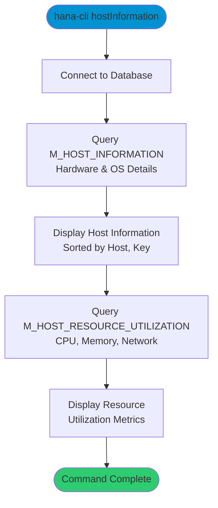

# hostInformation

> Command: `hostInformation`  
> Category: **System Admin**  
> Status: Production Ready

## Description

Display host technical details including hardware configuration, operating system information, and resource utilization. This command queries `M_HOST_INFORMATION` and `M_HOST_RESOURCE_UTILIZATION` system views to provide comprehensive host-level metrics.

## Syntax

```bash
hana-cli hostInformation [options]
```

## Aliases

- `hi`
- `HostInformation`
- `hostInfo`
- `hostinfo`

## Command Diagram



## Parameters

### Connection Parameters

| Option    | Alias | Type    | Default | Description                                          |
|-----------|-------|---------|---------|------------------------------------------------------|
| `--admin` | `-a`  | boolean | `false` | Connect via admin (default-env-admin.json)           |
| `--conn`  | -     | string  | -       | Connection filename to override default-env.json     |

### Troubleshooting

| Option              | Alias     | Type    | Default | Description                                                                                              |
|---------------------|-----------|---------|---------|----------------------------------------------------------------------------------------------------------|
| `--disableVerbose`  | `--quiet` | boolean | `false` | Disable verbose output - removes all extra output that is only helpful to human readable interface       |
| `--debug`           | `-d`      | boolean | `false` | Debug hana-cli itself by adding output of LOTS of intermediate details                                   |

## Examples

### View Host Information

```bash
hana-cli hostInformation
```

Display comprehensive host information and resource utilization.

### Using Short Alias

```bash
hana-cli hi
```

Quickly view host information using the short alias.

## Related Commands

See the [Commands Reference](../all-commands.md) for other commands in this category.

## See Also

- [Category: System Admin](..)
- [systemInfo](./system-info.md) - System information
- [disks](./disks.md) - Disk information
- [ports](./ports.md) - Port assignments
- [All Commands A-Z](../all-commands.md)
