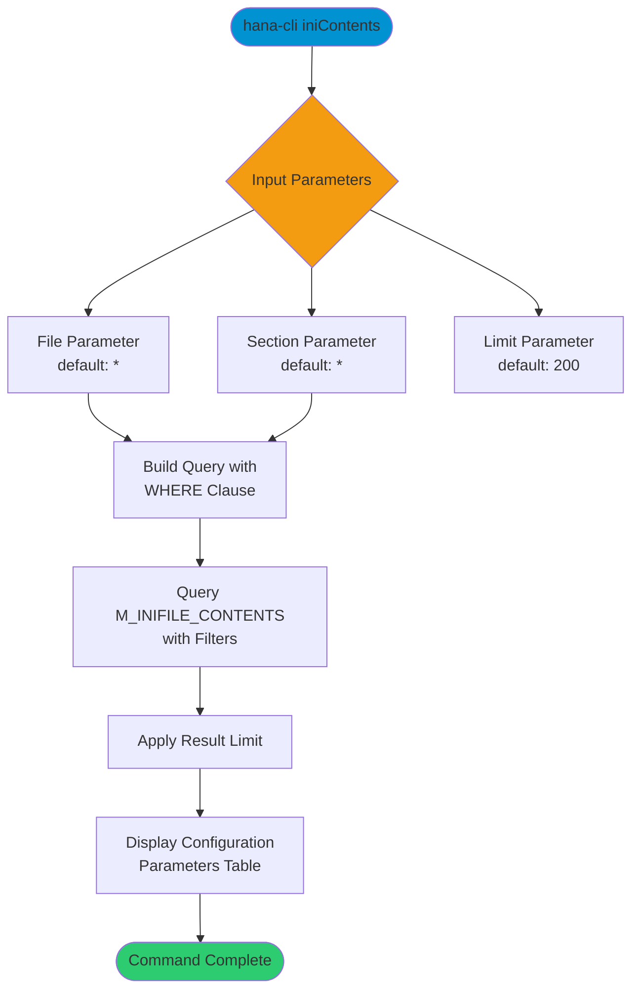

# iniContents

> Command: `iniContents`  
> Category: **System Admin**  
> Status: Production Ready

## Description

View the contents of INI configuration files filtered by file name and section. This command queries the `M_INIFILE_CONTENTS` system view to display specific configuration parameters and their values. Supports wildcard patterns for flexible filtering.

## Syntax

```bash
hana-cli iniContents [file] [section] [options]
```

## Aliases

- `ic`

## Command Diagram



## Parameters

### Positional Arguments

| Parameter | Type   | Description                                          |
|-----------|--------|------------------------------------------------------|
| `file`    | string | INI file name to filter (supports wildcards, default: `*`) |
| `section` | string | Section name to filter (supports wildcards, default: `*`)  |

### Options

| Option     | Alias | Type   | Default | Description                                   |
|------------|-------|--------|---------|-----------------------------------------------|
| `--file`   | `-f`  | string | `*`     | INI file name (alternative to positional arg) |
| `--section`| `-s`  | string | `*`     | Section name (alternative to positional arg)  |
| `--limit`  | `-l`  | number | `200`   | Maximum number of configuration entries       |

### Connection Parameters

| Option    | Alias | Type    | Default | Description                                          |
|-----------|-------|---------|---------|------------------------------------------------------|
| `--admin` | `-a`  | boolean | `false` | Connect via admin (default-env-admin.json)           |
| `--conn`  | -     | string  | -       | Connection filename to override default-env.json     |

### Troubleshooting

| Option              | Alias     | Type    | Default | Description                                                                                              |
|---------------------|-----------|---------|---------|----------------------------------------------------------------------------------------------------------|
| `--disableVerbose`  | `--quiet` | boolean | `false` | Disable verbose output - removes all extra output that is only helpful to human readable interface       |
| `--debug`           | `-d`      | boolean | `false` | Debug hana-cli itself by adding output of LOTS of intermediate details                                   |

## Examples

### View All Configuration Contents

```bash
hana-cli iniContents
```

Display all INI file contents (limited to 200 entries).

### Filter by File Name

```bash
hana-cli iniContents --file indexserver.ini
```

Display contents of the indexserver.ini configuration file.

### Filter by File and Section

```bash
hana-cli iniContents --file indexserver.ini --section memorymanager
```

Display memory manager settings from indexserver.ini.

### Using Wildcards

```bash
hana-cli iniContents --file "*server*.ini" --section "memory*"
```

Display all memory-related settings from server configuration files.

## Related Commands

See the [Commands Reference](../all-commands.md) for other commands in this category.

## See Also

- [Category: System Admin](..)
- [iniFiles](./ini-files.md) - List all INI configuration files
- [All Commands A-Z](../all-commands.md)
