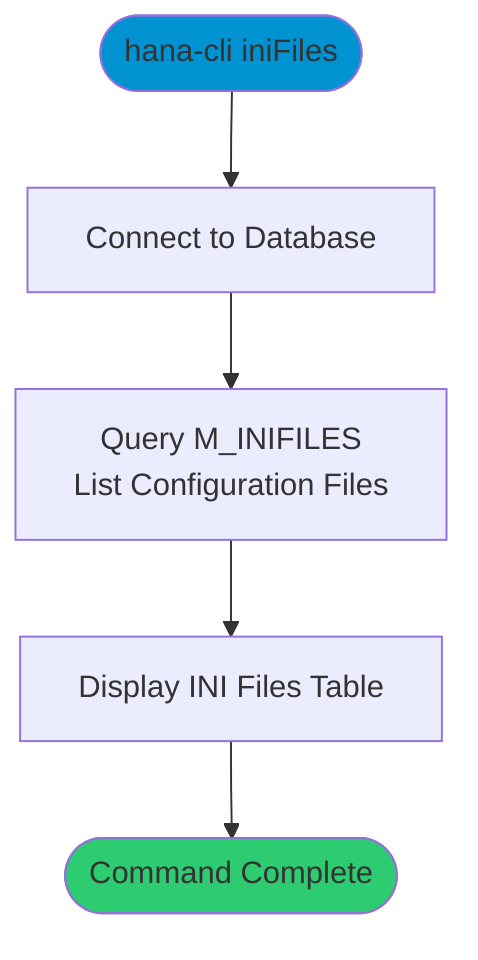

# iniFiles

> Command: `iniFiles`  
> Category: **System Admin**  
> Status: Production Ready

## Description

List all INI configuration files for SAP HANA from the `M_INIFILES` system view. This command displays available configuration files that control various aspects of the database system.

## Syntax

```bash
hana-cli iniFiles [options]
```

## Aliases

- `if`
- `inifiles`
- `ini`

## Command Diagram



## Parameters

### Connection Parameters

| Option    | Alias | Type    | Default | Description                                          |
|-----------|-------|---------|---------|------------------------------------------------------|
| `--admin` | `-a`  | boolean | `false` | Connect via admin (default-env-admin.json)           |
| `--conn`  | -     | string  | -       | Connection filename to override default-env.json     |

### Troubleshooting

| Option              | Alias     | Type    | Default | Description                                                                                              |
|---------------------|-----------|---------|---------|----------------------------------------------------------------------------------------------------------|
| `--disableVerbose`  | `--quiet` | boolean | `false` | Disable verbose output - removes all extra output that is only helpful to human readable interface       |
| `--debug`           | `-d`      | boolean | `false` | Debug hana-cli itself by adding output of LOTS of intermediate details                                   |

## Examples

### List All INI Files

```bash
hana-cli iniFiles
```

Display all available INI configuration files.

## Related Commands

See the [Commands Reference](../all-commands.md) for other commands in this category.

## See Also

- [Category: System Admin](..)
- [iniContents](./ini-contents.md) - View contents of specific INI files
- [All Commands A-Z](../all-commands.md)
