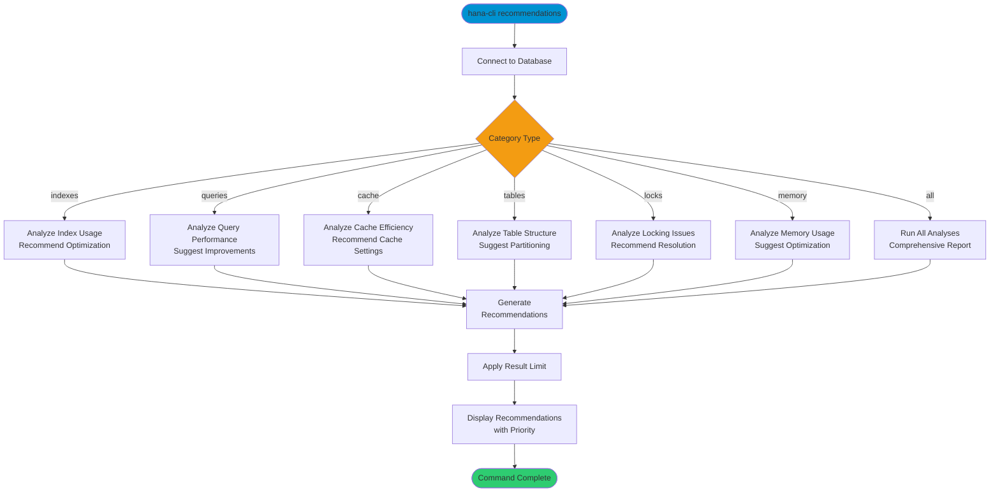

# recommendations

> Command: `recommendations`  
> Category: **System Admin**  
> Status: Production Ready

## Description

Generate AI-based performance recommendations for SAP HANA database optimization. This command analyzes various database aspects including indexes, queries, cache, tables, locks, and memory to provide actionable improvement suggestions.

## Syntax

```bash
hana-cli recommendations [options]
```

## Aliases

- `rec`
- `recommend`

## Command Diagram



## Parameters

### Options

| Option       | Alias | Type   | Default | Description                                                                                           |
|--------------|-------|--------|---------|-------------------------------------------------------------------------------------------------------|
| `--category` | `-c`  | string | `all`   | Recommendation category. Choices: `all`, `indexes`, `queries`, `cache`, `tables`, `locks`, `memory`  |
| `--limit`    | `-l`  | number | `50`    | Maximum number of recommendations to return                                                           |

### Connection Parameters

| Option    | Alias | Type    | Default | Description                                          |
|-----------|-------|---------|---------|------------------------------------------------------|
| `--admin` | `-a`  | boolean | `false` | Connect via admin (default-env-admin.json)           |
| `--conn`  | -     | string  | -       | Connection filename to override default-env.json     |

### Troubleshooting

| Option              | Alias     | Type    | Default | Description                                                                                              |
|---------------------|-----------|---------|---------|----------------------------------------------------------------------------------------------------------|
| `--disableVerbose`  | `--quiet` | boolean | `false` | Disable verbose output - removes all extra output that is only helpful to human readable interface       |
| `--debug`           | `-d`      | boolean | `false` | Debug hana-cli itself by adding output of LOTS of intermediate details                                   |

## Examples

### All Recommendations

```bash
hana-cli recommendations --category all
```

Generate comprehensive recommendations across all categories.

### Index Recommendations

```bash
hana-cli recommendations --category indexes --limit 25
```

Get top 25 index optimization recommendations.

### Query Performance

```bash
hana-cli recommendations --category queries --limit 10
```

Analyze query performance and get top 10 improvement suggestions.

## Related Commands

See the [Commands Reference](../all-commands.md) for other commands in this category.

## See Also

- [Category: System Admin](..)
- [healthCheck](./health-check.md) - Comprehensive health assessment
- [diagnose](./diagnose.md) - System diagnostics
- [All Commands A-Z](../all-commands.md)
