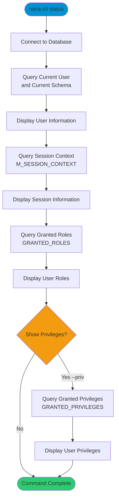

# status

> Command: `status`  
> Category: **System Admin**  
> Status: Production Ready

## Description

Get Connection Status and user information. This command displays the current database connection details, including the current user, current schema, session context information, granted roles, and optionally, granted privileges.

## Syntax

```bash
hana-cli status [options]
```

## Aliases

- `s`
- `whoami`

## Command Diagram



## Parameters

### Options

| Option   | Alias                | Type    | Default | Description                                   |
|----------|----------------------|---------|---------|-----------------------------------------------|
| `--priv` | `-p`, `--privileges` | boolean | `false` | Display granted privileges in addition to roles |

### Connection Parameters

| Option    | Alias | Type    | Default | Description                                          |
|-----------|-------|---------|---------|------------------------------------------------------|
| `--admin` | `-a`  | boolean | `false` | Connect via admin (default-env-admin.json)           |
| `--conn`  | -     | string  | -       | Connection filename to override default-env.json     |

### Troubleshooting

| Option              | Alias     | Type    | Default | Description                                                                                              |
|---------------------|-----------|---------|---------|----------------------------------------------------------------------------------------------------------|
| `--disableVerbose`  | `--quiet` | boolean | `false` | Disable verbose output - removes all extra output that is only helpful to human readable interface       |
| `--debug`           | `-d`      | boolean | `false` | Debug hana-cli itself by adding output of LOTS of intermediate details                                   |

## Examples

### Basic Usage

```bash
hana-cli status
```

Display current user, schema, session context, and granted roles.

### View With Privileges

```bash
hana-cli status --priv
```

Display connection status including all granted privileges.

### Using Alias

```bash
hana-cli whoami
```

Quick check of current database user using the `whoami` alias.

## Related Commands

See the [Commands Reference](../all-commands.md) for other commands in this category.

## See Also

- [Category: System Admin](..)
- [systemInfo](./system-info.md) - Display database system information
- [healthCheck](./health-check.md) - Perform comprehensive health checks
- [All Commands A-Z](../all-commands.md)
